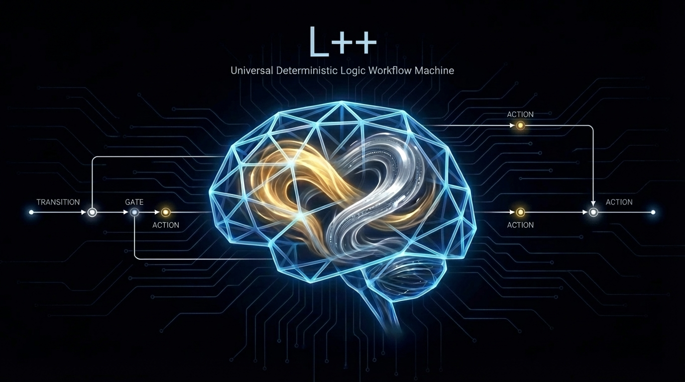

# L++ (Logic Plus Plus)

**The Universal Deterministic Logic Workflow Machine.**

> "Civilization advances by extending the number of important operations which we can perform without thinking about them." — Alfred North Whitehead

## ◼️ The Manifesto

We are entering an era where compute is cheap, volatile, and increasingly generated by AI. In this new reality, the value of software engineering shifts from writing syntax to authoring rigorous, verifiable business logic.

**The power of logical thinking becomes ever more important when facing intelligence.**

L++ aims to provide a logical frame that wraps around intelligence, carbon or silicon, to perform the art of engineering.

Crucially, L++ is not a stubborn cage that limits the possibilities of intelligence. Rather, it is the internal skeletal support that allows for organic growth within any engineering task. It provides the structure necessary for systems to behave predictably, making complex operations transparent and providing greater support for ambitious engineering goals, even when components are built by non-deterministic AI models or messy human collaboration.


**L++ is a paradigm shift that separates eternal logic from ephemeral compute.**

It is designed on the premise that while implementation details (the "flesh") may change rapidly, the core business rules and state transitions (the "bone") must remain deterministic, auditable, and platform-agnostic. L++ provides the structure to ensure that systems behave predictably, even when their components are built by non-deterministic AI models.

## ◼️ What is L++?

L++ is not a programming language. It is a language-agnostic **Logic Frame** designed to execute business processes defined in purely symbolic, declarative blueprints.

Think of it as a virtual machine for business logic.
*   **The Blueprint (JSON):** Acts as the "bytecode," defining states, transitions, and rules.
*   **The Frame (Engine):** Acts as the CPU, executing the blueprint deterministically.
*   **The Compute Units (Functions):** Act as the instruction set, performing isolated tasks with strict I/O.

### Core Principles

1.  **Symbolic Sovereignty:** The JSON blueprint is the single source of truth. There is no "hidden logic" buried in code.
2.  **Absolute Determinism:** Given the same state and same input event, the Frame will *always* produce the exact same transition and action set.
3.  **Hermetic Compute:** Functional code is reduced to isolated, stateless units with strict input/output contracts, making them perfectly testable and secure.
4.  **Minimalist Atomic Operators:** All complex logic is reduced to four fundamental operations handled by the Frame: **TRANSITION**, **GATE**, **ACTION**, and **FORK/JOIN**.

## ◼️ Architecture

```mermaid
graph TD
    Blueprint[(L++ Blueprint\nJSON)] -->|Loads Definition| Frame
    Event[Inbound Event] -->|Triggers| Frame
    Context[(Context Store\nState)] <-->|Reads/Writes| Frame

    subgraph "The L++ Frame (Runtime Engine)"
        Frame[Logic Interpreter & State Machine]
        Policy[Policy Evaluator (GATES)]
    end

    Frame -->|Consults| Policy
    Frame -->|Dispatches Command| Dispatcher[Action Dispatcher]

    subgraph "The Compute Layer (Volatile Flesh)"
        Dispatcher -->|Executes| UnitA[Compute Unit A\n(e.g., AI Generated API Call)]
        Dispatcher -->|Executes| UnitB[Compute Unit B\n(e.g., Legacy System Wrapper)]
    end

    UnitA -->|Standard I/O Result| Frame
    UnitB -->|Standard I/O Result| Frame
```

## ◼️ Why L++?

*   **AI-Ready Security:** By isolating compute into hermetic units with standard I/O, L++ drastically reduces the blast radius of errors or vulnerabilities introduced by AI-generated code.
*   **True Logic Portability:** Business logic is no longer locked into a specific vendor's platform or a specific programming language. The blueprint can run on any L++ compliant Frame.
*   **Elevated Engineering:** Shifting focus from boilerplate plumbing to high-value logic architecture and system design.
*   **Mastery over Complexity:** By forcing explicit definitions of states and transitions, L++ makes even massive, complex systems visualizable, debuggable, and auditable.

## ◼️ Getting Started

*(This section will be populated as the prototype is built. It will include links to the schema specification, the prototype frame implementation, and example blueprints like "Hello World".)*

*   **Schema Specification:** `docs/schema_v0.1.md`
*   **Frame Prototype (Python):** `src/frame_py/`
*   **Examples:** `examples/`

## ◼️ License

MIT
