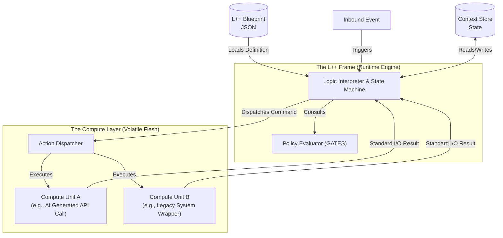

# L++ (Logic Plus Plus)

**The Universal Deterministic Logic Workflow Machine.**

> "Civilization advances by extending the number of important operations which we can perform without thinking about them." — Alfred North Whitehead

## Quick Install

```bash
pip install -e .
```

## Package Structure

```
lpp (v1.1.0)
├── lpp.core     - Core runtime (atoms, loader, compiler, validators)
├── lpp.util     - 28 utility tools (test generator, linter, decoder, etc.)
├── lpp.workflow - 3 workflows (py2lpp, lvp, canvas)
└── lpp.agent    - Claude Code agents (lppcoder, lppoperator)
```

## Usage Examples

### Python API

```python
# Core imports
from lpp.core import BlueprintLoader, compile_blueprint, run_frame
from lpp.core.validators import validate_blueprint, validateAssembly

# Load a blueprint
import json
with open("blueprint.json") as f:
    raw = json.load(f)

loader = BlueprintLoader(raw)
blueprint, error = loader.load()

# Compile to Python
code, error = compile_blueprint("blueprint.json", "output.py")

# Execute events
new_state, new_ctx, traces, error = run_frame(
    blueprint, context, "START", {}, compute_registry
)

# Utilities
from lpp.util import list_utilities, get_utility
from lpp.util.logic_decoder import run as decode

# Workflows
from lpp.workflow import list_workflows
from lpp.workflow.python_to_lpp import run as refactor

# Agents
from lpp.agent import deploy_agents, list_agents
deploy_agents("/path/to/project")
```

### CLI Commands

```bash
# Main CLI
lpp version                        # Show version
lpp list                           # List all utils/workflows/agents
lpp list --utils                   # List utilities only
lpp list --workflows               # List workflows only
lpp list --agents                  # List agents only

# Core tools
lpp compile blueprint.json out.py  # Compile blueprint to Python
lpp visualize blueprint.json       # Generate visualization
lpp validate blueprint.json        # Validate blueprint
lpp validate assembly.json --assembly  # Validate assembly

# Run utilities
lpp util logic_decoder myfile.py   # Decode Python to L++ blueprint
lpp util blueprint_linter bp.json  # Lint a blueprint
lpp util test_generator bp.json    # Generate tests

# Run workflows
lpp workflow python_to_lpp /path   # Convert Python project to L++
lpp workflow lpp_canvas            # Launch blueprint designer

# Manage Claude agents
lpp agent list                     # List available agents
lpp agent deploy /path/to/project  # Deploy agents to project
lpp agent show lppcoder            # Show agent documentation
```

### Direct CLI Tools

```bash
lpp-compile blueprint.json output.py   # Compile blueprint
lpp-visualize blueprint.json           # Visualize blueprint
lpp-agent deploy /path/to/project      # Deploy agents
lpp-py2lpp /path/to/python/project     # Convert Python to L++
lpp-lvp /path/to/target                # Security vulnerability scan
```

---

## The Manifesto

We are entering an era where compute is cheap, volatile, and increasingly generated by AI. In this new reality, the value of software engineering shifts from writing syntax to authoring rigorous, verifiable business logic.

**The power of logical thinking becomes ever more important when facing intelligence.**

L++ aims to provide a logical frame that wraps around intelligence, carbon or silicon, to perform the art of engineering.

**L++ is a paradigm shift that separates eternal logic from ephemeral compute.**

It is designed on the premise that while implementation details (the "flesh") may change rapidly, the core business rules and state transitions (the "bone") must remain deterministic, auditable, and platform-agnostic.

## What is L++?

L++ is not a programming language. It is a language-agnostic **Logic Frame** designed to execute business processes defined in purely symbolic, declarative blueprints.

Think of it as a virtual machine for business logic.
*   **The Blueprint (JSON):** Acts as the "bytecode," defining states, transitions, and rules.
*   **The Frame (Engine):** Acts as the CPU, executing the blueprint deterministically.
*   **The Compute Units (Functions):** Act as the instruction set, performing isolated tasks with strict I/O.

### Core Principles

1.  **Symbolic Sovereignty:** The JSON blueprint is the single source of truth. There is no "hidden logic" buried in code.
2.  **Absolute Determinism:** Given the same state and same input event, the Frame will *always* produce the exact same transition and action set.
3.  **Hermetic Compute:** Functional code is reduced to isolated, stateless units with strict input/output contracts, making them perfectly testable and secure.
4.  **Minimalist Atomic Operators:** All complex logic is reduced to four fundamental operations: **EVALUATE**, **TRANSITION**, **MUTATE**, and **DISPATCH**.

## Architecture



## Why L++?

*   **AI-Ready Security:** By isolating compute into hermetic units with standard I/O, L++ drastically reduces the blast radius of errors or vulnerabilities introduced by AI-generated code.
*   **True Logic Portability:** Business logic is no longer locked into a specific vendor's platform or a specific programming language. The blueprint can run on any L++ compliant Frame.
*   **Elevated Engineering:** Shifting focus from boilerplate plumbing to high-value logic architecture and system design.
*   **Mastery over Complexity:** By forcing explicit definitions of states and transitions, L++ makes even massive, complex systems visualizable, debuggable, and auditable.

---

## Package Reference

### lpp.core - Core Runtime

The four atomic operations that power all L++ execution:

| Function | Description |
|----------|-------------|
| `atom_EVALUATE` | Evaluate boolean expressions against context |
| `atom_TRANSITION` | Update state pointer with audit trail |
| `atom_MUTATE` | Update context data at dot-notation paths |
| `atom_DISPATCH` | Execute compute units with I/O contracts |

Key modules:

| Module | Description |
|--------|-------------|
| `loader` | Load and validate JSON blueprints |
| `compiler` | Compile blueprints to executable Python |
| `orchestrator` | Run event dispatch cycles |
| `validators` | Blueprint, assembly, TLA+ validation |

### lpp.util - 28 Utility Tools

| Category | Utilities |
|----------|-----------|
| **Blueprint Tools** | blueprint_builder, blueprint_composer, blueprint_debugger, blueprint_differ, blueprint_linter, blueprint_playground, blueprint_registry |
| **Code Analysis** | logic_decoder, legacy_extractor, function_decoder |
| **Testing** | test_generator, event_simulator, coverage_analyzer, compliance_checker |
| **Verification** | tlaps_seal, tlaps_prover |
| **Documentation** | doc_generator, graph_visualizer, dashboard, visualizer |
| **Discovery** | skill_registry, skill_contractor, task_orchestrator |
| **Integration** | llm_assistant, research_scraper, scholar_chat |
| **Migration** | schema_migrator |

### lpp.workflow - 3 Workflows

| Workflow | Description |
|----------|-------------|
| `python_to_lpp` | Convert Python projects to L++ blueprints |
| `logic_vulnerability_pointer` | Security analysis and vulnerability detection |
| `lpp_canvas` | Interactive blueprint design studio |

### lpp.agent - Claude Code Agents

| Agent | Description |
|-------|-------------|
| `lppcoder` | Code generation agent - auto-generates tests after changes |
| `lppoperator` | Workflow operator - runs and manages L++ workflows |

Deploy to any project:
```bash
lpp agent deploy /path/to/project
```

---

## Development

### Build & Test

```bash
# Install with dev dependencies
pip install -e ".[dev]"

# Run tests
pytest

# Generate documentation
./deploy.sh docs

# Validate with TLA+
./deploy.sh validate

# Generate tests
./deploy.sh tests

# Run full test suite
./test_all.sh
```

### Backward Compatibility

The old `frame_py` imports still work but emit deprecation warnings:

```python
# Deprecated (still works)
from frame_py import BlueprintLoader

# Recommended
from lpp.core import BlueprintLoader
```

---

## Documentation

*   **Schema Specification:** `docs/schema/schema_v0.2.0.md`
*   **Assembly Schema:** `docs/schema/assembly_schema_v0.1.md`
*   **Build Rules:** `docs/agent/build_rules.md`
*   **Examples:** `examples/`

## License

MIT
