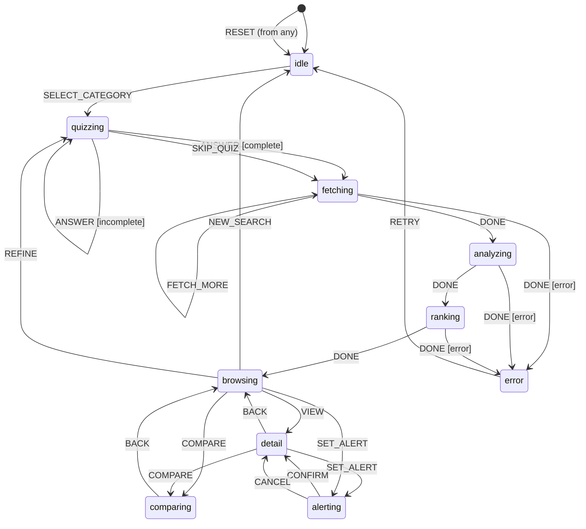

# Discovery Shopping

**Fit-first product discovery with explainable matching and transparent rankings.**

## Overview

A quiz-driven shopping experience that:
1. Learns user preferences via quick quiz
2. Fetches products from feeds/APIs
3. Aggregates review insights with source attribution
4. Ranks products with transparent "why this" explanations
5. Supports side-by-side comparisons
6. Enables price/restock alerts
7. Monetizes via affiliate links

## State Machine



## Usage

### Web App (Recommended)

```bash
cd examples/python/discovery_shopping
python app.py
# Open http://localhost:10001
```

### CLI Mode

```bash
cd examples/python/discovery_shopping
python interactive.py
```

### Example Session

```
🛒 Discovery Shopping - Fit-First Product Discovery
==================================================
Commands: <event> [args] | state | ctx | quit

[idle] > SELECT_CATEGORY {"category": "headphones"}
→ quizzing

📋 Quiz Questions:
  q1: Primary use?
      Options: Music, Gaming, Calls, Mixed
  q2: Form factor?
      Options: Over-ear, On-ear, In-ear, Earbuds
  ...

[quizzing] > ANSWER {"question_id": "q1", "answer": "Music"}
→ quizzing

[quizzing] > SKIP_QUIZ
→ fetching

📦 Found 5 products

[fetching] > DONE
→ analyzing

[analyzing] > DONE
→ ranking

🏆 Product Rankings:
  1. Studio Reference ($349.99)
     Score: 0.89 | Rating: 4.9/5
     Why: Highly rated (4.9/5); In stock
  2. SoundPro X1 ($149.99)
     Score: 0.75 | Rating: 4.5/5
     Why: Good value at $150; Highly rated (4.5/5)
  ...

[ranking] > DONE
→ browsing

[browsing] > VIEW {"product_id": "hp001"}
→ detail

[detail] > COMPARE {"product_ids": ["hp001", "hp002"]}
→ comparing

⚖️ Side-by-Side Comparison:
  Price:
    ✓ BassMax 300: $79.99
      SoundPro X1: $149.99
  Rating:
    ✓ SoundPro X1: 4.5/5 (1250 reviews)
      BassMax 300: 4.2/5 (3420 reviews)
  ...
```

## Events

| Event | From States | Description |
|-------|-------------|-------------|
| `SELECT_CATEGORY` | idle | Start discovery for a category |
| `ANSWER` | quizzing | Submit quiz answer |
| `SKIP_QUIZ` | quizzing | Skip remaining questions |
| `FETCH_MORE` | fetching | Load more products |
| `DONE` | fetching, analyzing, ranking | Progress to next phase |
| `VIEW` | browsing | View product detail |
| `COMPARE` | browsing, detail | Compare multiple products |
| `BACK` | detail, comparing | Return to browsing |
| `SET_ALERT` | browsing, detail | Set price/restock alert |
| `CONFIRM` | alerting | Confirm alert subscription |
| `CANCEL` | alerting | Cancel alert setup |
| `REFINE` | browsing | Re-take quiz with new preferences |
| `NEW_SEARCH` | browsing | Start over with new category |
| `RETRY` | error | Recover from error |
| `RESET` | * | Global reset to idle |

## Compute Units

| Unit | Description |
|------|-------------|
| `shop:generate_quiz` | Generate preference questions for category |
| `shop:record_answer` | Store user answer and advance index |
| `shop:extract_preferences` | Convert Q&A to preference weights |
| `shop:fetch_products` | Pull products with affiliate links |
| `shop:aggregate_reviews` | Aggregate review signals (volume, recency, pros/cons) |
| `shop:rank_products` | Score and explain "why this" rankings |
| `shop:compare_products` | Side-by-side comparison matrix |
| `shop:add_alert` | Subscribe to price/restock alerts |
| `shop:reset` | Clear all context |

## Transparency & Trust

- **Explainable Rankings**: Each product shows breakdown scores and specific reasons
- **Review Attribution**: Sources linked for all review insights
- **Affiliate Disclosure**: Affiliate links clearly identified in context
- **Preference Weights**: User can see how their answers influence rankings

## TLA+ Verification

```
States: 127
Distinct: 63
Depth: 6
Result: PASS
```

## Files

```
discovery_shopping/
├── discovery_shopping.json    # Blueprint (bone)
├── app.py                     # Web app - minimal HTTP wrapper
├── interactive.py             # CLI wrapper (extrusion)
├── src/
│   ├── __init__.py
│   ├── shopping_compute.py    # Compute units (flesh)
│   └── shopping_view.py       # View rendering (hermetic)
├── results/
│   └── discovery_shopping_compiled.py
└── tla/
    ├── discovery_shopping.tla
    └── discovery_shopping.cfg
```

## Future Enhancements

- [ ] Real API integrations (Amazon, BestBuy, etc.)
- [ ] Persistent alert storage (SQLite)
- [ ] LLM-powered preference extraction
- [ ] Price history charts
- [ ] Bias transparency scoring
