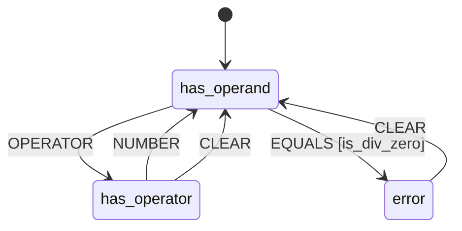

# L++ Calculator

**Version:** 1.0.0  
**ID:** `calculator`

## State Machine

## States

| State | Description |
|-------|-------------|
| ● `has_operand` | Has operand(s), waiting for operator or = |
| `has_operator` | Has operator, waiting for next operand |
| `error` | Error state |

## Gates

| Gate | Expression |
|------|------------|
| `has_a` | `a is not None` |
| `has_b` | `b is not None` |
| `has_op` | `op in ('+', '-', '*', '/')` |
| `no_a` | `a is None` |
| `no_b` | `b is None` |
| `is_error` | `_state == 'error'` |
| `is_has_operator` | `_state == 'has_operator'` |
| `can_compute` | `a is not None and b is not None and op in ('+', '-', '*', '/')` |
| `is_div_zero` | `op == '/' and b == 0` |
| `safe_compute` | `a is not None and b is not None and op in ('+', '-', '*', '/') and not (op == '/' and b == 0)` |

## Actions

| Action | Type |
|--------|------|
| `set_a` | set |
| `set_b` | set |
| `set_operator` | set |
| `compute` | compute |
| `clear_b` | set |
| `clear_op` | set |
| `set_error` | set |
| `clear_a` | set |
| `clear_error` | set |

## Transitions

| ID | From | To | Event | Gate | Actions |
|----|------|-----|-------|------|---------|
| `t_set_operator` | has_operand | has_operator | OPERATOR | - | set_operator |
| `t_set_b` | has_operator | has_operand | NUMBER | - | set_b |
| `t_set_a` | has_operand | has_operand | NUMBER | no_a | set_a |
| `t_compute` | has_operand | has_operand | EQUALS | safe_compute | compute, clear_b, clear_op |
| `t_div_zero` | has_operand | error | EQUALS | is_div_zero | set_error |
| `t_clear` | * | has_operand | CLEAR | - | clear_a, clear_b, clear_op, clear_error |

---

*Generated by L++ README Generator (compiled L++ operator)*