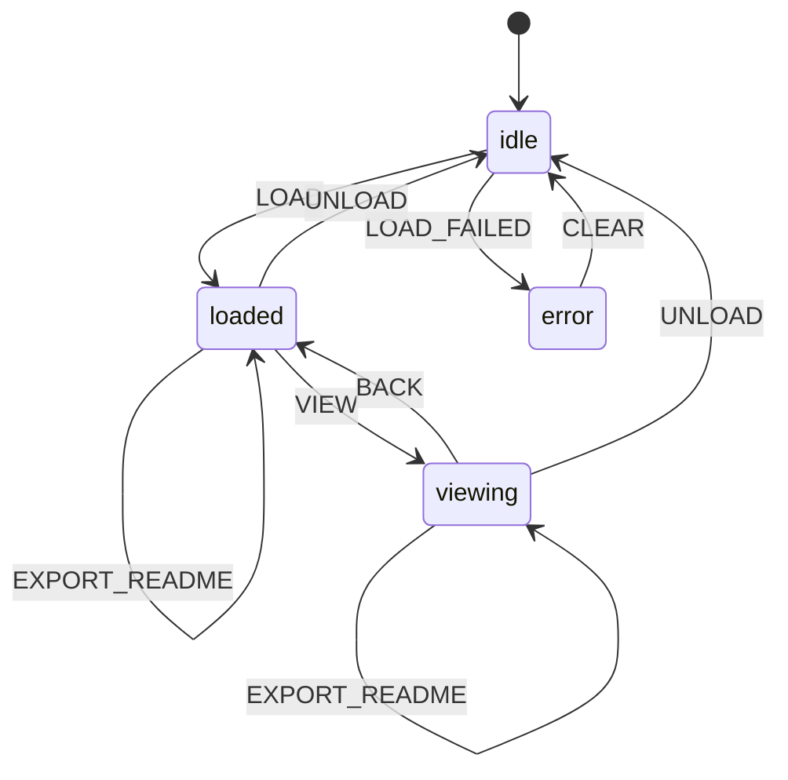

# L++ Visualizer Example

> **L++ visualizing itself** - A meta-example demonstrating self-reference

This example uses L++ to build an interactive visualizer for L++ blueprints. 
It can even visualize its own blueprint - the framework examining itself.

## The Philosophy

```
┌─────────────────────────────────────────────────────────────┐
│                    THE META-PATTERN                         │
├─────────────────────────────────────────────────────────────┤
│                                                             │
│   L++ Blueprint ──────▶ L++ Visualizer ──────▶ Output       │
│        ↑                      │                             │
│        └──────────────────────┘                             │
│              (self-reference)                               │
│                                                             │
└─────────────────────────────────────────────────────────────┘
```

## Usage

```bash
# Navigate to the example directory
cd examples/visualizer

# Start the interactive visualizer
python interactive.py

# Or load a blueprint directly
python interactive.py ../math_compute/math_compute.json
```

## Commands

| Command | Description |
|---------|-------------|
| `load <path>` | Load a blueprint JSON file |
| `self` | Load the visualizer's own blueprint (meta!) |
| `calc` | Load the calculator example |
| `view` | Start viewing mode |
| `graph` | ASCII graph view |
| `table` | Table view |
| `mermaid` | Mermaid diagram code |
| `export <path>` | Export README.md with tables and mermaid |
| `select <id>` | Select a state or transition |
| `+` / `-` | Zoom in/out |
| `gates` | Toggle gate expressions |
| `actions` | Toggle action details |
| `state` | Show current context |
| `help` | Show all commands |
| `quit` | Exit |

## README Generation

The visualizer can export a complete README.md for any L++ blueprint:

```bash
# In the interactive CLI
> load ../math_compute/math_compute.json
> export ../math_compute/README.md

# Or programmatically
viz = load_visualizer()
viz.dispatch('LOAD', {'path': 'my_blueprint.json'})
viz.dispatch('EXPORT_README', {'path': 'README.md'})
```

The generated README includes:
- **Mermaid state diagram** - Visual representation of states and transitions
- **States table** - All states with descriptions
- **Gates table** - All gate expressions
- **Actions table** - All action types
- **Transitions table** - Complete transition matrix

## Architecture

```
visualizer/
├── visualizer.json      # L++ Blueprint (the "Bone")
├── interactive.py       # CLI + COMPUTE units (the "Flesh")
├── src/
│   └── readme_generator.py  # README generation tools
└── results/             # Compiled output
```

### COMPUTE Units (Flesh)

| Unit | Function |
|------|----------|
| `viz:load_blueprint` | Load and parse L++ JSON |
| `viz:render_graph` | ASCII graph visualization |
| `viz:render_table` | Table visualization |
| `viz:render_mermaid` | Mermaid diagram code |
| `viz:generate_readme` | Generate README markdown |
| `viz:write_readme` | Write README to file |

## State Machine



## Files

- `visualizer.json` - The L++ blueprint (the "Bone")
- `interactive.py` - The CLI and COMPUTE units (the "Flesh")
- `src/readme_generator.py` - README generation tool module
- `results/` - Compiled output (generated)
