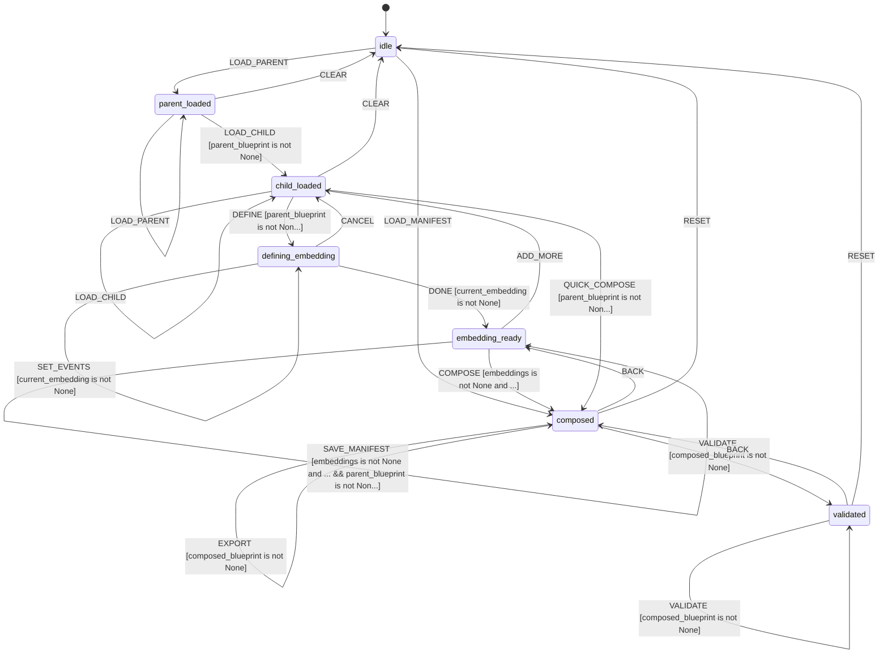

# L++ Blueprint Composer

A hierarchical composition tool for L++ blueprints that enables embedding sub-blueprints as "macro states" with defined interface contracts.

## Overview

The Blueprint Composer allows you to:
- **Embed sub-blueprints**: Replace a parent state with an entire child blueprint
- **Define interface contracts**: Map context properties between parent and child
- **Namespace prefixing**: Avoid ID collisions with automatic prefixing
- **Event mapping**: Translate parent events to child events
- **Validate compositions**: Ensure no circular references or broken contracts

## Usage

### Interactive Mode

```bash
cd utils/blueprint_composer
python interactive.py
```

### With Arguments

```bash
# Load a parent blueprint
python interactive.py path/to/parent.json

# Load a composition manifest
python interactive.py path/to/manifest.json
```

## Commands

### Loading

| Command | Description |
|---------|-------------|
| `parent <path>` | Load parent blueprint |
| `child <path>` | Load child blueprint to embed |
| `manifest <path>` | Load composition manifest |

### Defining Embeddings

| Command | Description |
|---------|-------------|
| `define [state]` | Start defining embedding for target state |
| `input <json>` | Set input contract mapping |
| `output <json>` | Set output contract mapping |
| `events <json>` | Set event mapping |
| `done` | Finalize current embedding |

### Composition

| Command | Description |
|---------|-------------|
| `compose` | Execute composition |
| `quick <state>` | Quick compose with defaults |
| `validate` | Validate composed blueprint |
| `flatten` | Flatten nested compositions |

### Export

| Command | Description |
|---------|-------------|
| `export <path>` | Export composed blueprint |
| `savemanifest <path>` | Save composition manifest |

## Composition Manifest Format

```json
{
  "parent": "path/to/parent.json",
  "embeddings": [
    {
      "target_state": "processing",
      "child": "path/to/child.json",
      "namespace_prefix": "proc",
      "contract": {
        "input_map": {"parent_ctx.input": "child_ctx.data"},
        "output_map": {"child_ctx.result": "parent_ctx.output"}
      },
      "event_map": {"PROCESS": "START", "DONE": "COMPLETE"}
    }
  ]
}
```

## How Composition Works

### 1. Macro State Embedding

When you embed a child blueprint into a parent state:
- The target parent state is replaced by the child's state machine
- Parent transitions TO the target state now go to child's entry state
- Parent transitions FROM the target state originate from child's terminal states

### 2. Namespace Prefixing

All child element IDs are prefixed to avoid collisions:
- States: `{prefix}$state_id`
- Gates: `{prefix}$gate_id`
- Actions: `{prefix}$action_id`
- Transitions: `{prefix}$transition_id`
- Context properties: `{prefix}$property`

### 3. Interface Contracts

The contract defines how context flows between parent and child:

```json
{
  "input_map": {
    "parent_property": "child_property"
  },
  "output_map": {
    "child_property": "parent_property"
  }
}
```

### 4. Event Mapping

Events can be translated between parent and child:

```json
{
  "PARENT_EVENT": "CHILD_EVENT"
}
```

## Example

### Parent Blueprint (workflow.json)

```json
{
  "states": {
    "idle": {},
    "processing": {},
    "complete": {}
  },
  "transitions": [
    {"from": "idle", "to": "processing", "on_event": "START"},
    {"from": "processing", "to": "complete", "on_event": "DONE"}
  ]
}
```

### Child Blueprint (processor.json)

```json
{
  "states": {
    "init": {},
    "step1": {},
    "step2": {},
    "finished": {}
  },
  "entry_state": "init",
  "terminal_states": ["finished"],
  "transitions": [
    {"from": "init", "to": "step1", "on_event": "BEGIN"},
    {"from": "step1", "to": "step2", "on_event": "NEXT"},
    {"from": "step2", "to": "finished", "on_event": "NEXT"}
  ]
}
```

### Composed Result

After embedding `processor.json` into the `processing` state:

```json
{
  "states": {
    "idle": {},
    "processing$init": {},
    "processing$step1": {},
    "processing$step2": {},
    "processing$finished": {},
    "complete": {}
  },
  "transitions": [
    {"from": "idle", "to": "processing$init", "on_event": "START"},
    {"from": "processing$init", "to": "processing$step1", "on_event": "BEGIN"},
    {"from": "processing$step1", "to": "processing$step2", "on_event": "NEXT"},
    {"from": "processing$step2", "to": "processing$finished", "on_event": "NEXT"},
    {"from": "processing$finished", "to": "complete", "on_event": "DONE"}
  ]
}
```

## State Machine


> **Interactive View:** [Open zoomable diagram](results/blueprint_composer_diagram.html) for pan/zoom controls


## State Machine Visualization

Interactive state machine diagram: [blueprint_composer_graph.html](results/blueprint_composer_graph.html)

Open the HTML file in a browser for:
- Zoom/pan navigation
- Click nodes to highlight connections
- Hover for gate conditions
- Multiple layout options (hierarchical, horizontal, circular, grid)

## Validation Checks

The composer validates:
1. **Circular references**: No blueprint can embed itself
2. **Contract satisfaction**: All mapped properties must exist
3. **ID collisions**: No duplicate IDs after prefixing
4. **State references**: All transition states must exist
5. **Entry/terminal states**: Must be valid after composition

## Files

| File | Description |
|------|-------------|
| `blueprint_composer.json` | L++ blueprint defining the composer state machine |
| `src/__init__.py` | Exports COMPOSE_REGISTRY |
| `src/composer_compute.py` | Compute functions for composition logic |
| `interactive.py` | CLI interface |
| `tests/` | Sample blueprints for testing |

## Testing

Run the built-in test:

```bash
python interactive.py
> test
```

This will:
1. Create sample parent and child blueprints
2. Define an embedding
3. Compose them
4. Validate the result
