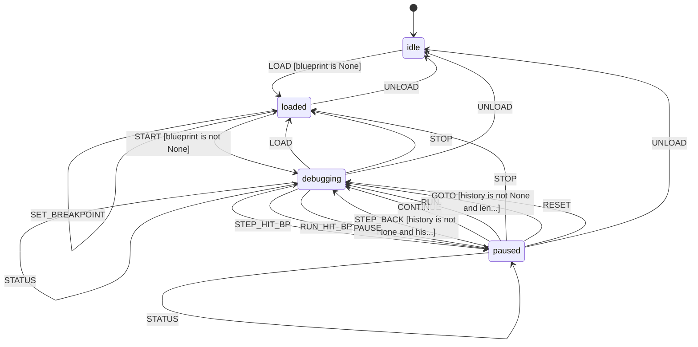

# L++ Blueprint Debugger

Step-through debugging for L++ blueprints with breakpoints, inspection, and time-travel debugging capabilities.

## Overview

The Blueprint Debugger is an L++ tool that allows you to debug any L++ blueprint by stepping through its execution, setting breakpoints, inspecting state and context, and traveling back through execution history.

## Features

### Breakpoint Types
- **State Breakpoints**: Break when entering a specific state
- **Transition Breakpoints**: Break when a specific transition is taken
- **Gate Breakpoints**: Break when a gate is evaluated
- **Event Breakpoints**: Break when a specific event is dispatched
- **Conditional Breakpoints**: Break when an expression evaluates to true

### Execution Control
- `step` - Execute one event/transition
- `step_over` - Execute without action details
- `step_back` - Go back to previous state
- `run` - Run until breakpoint or terminal state
- `continue` - Continue after breakpoint
- `pause` - Pause execution
- `reset` - Reset to initial state

### Time-Travel Debugging
- Step backward through execution history
- Jump to any previous step with `goto`
- Compare states at different points with `compare`
- Full history tracking with context snapshots

### Inspection
- View current state details
- View and search context values
- Evaluate expressions in current context
- Watch expressions that update on each step

## Usage

### Quick Start

```bash
cd utils/blueprint_debugger
python interactive.py ../visualizer/visualizer.json
```

### Commands

#### Loading
```
load <path>       - Load blueprint for debugging
unload            - Unload current blueprint
```

#### Debugging
```
start             - Start debug session
stop              - Stop debugging
reset             - Reset to initial state (keeps breakpoints)
```

#### Stepping
```
step [event]      - Step one transition
s [event]         - Alias for step
over [event]      - Step over (skip action details)
back              - Step back to previous state
b                 - Alias for back
```

#### Execution
```
run               - Run until breakpoint or terminal
continue          - Continue after breakpoint
c                 - Alias for continue
pause             - Pause execution
```

#### Breakpoints
```
bp <type> <target> [condition]
                  - Set breakpoint
bp state loaded   - Break on 'loaded' state
bp event LOAD     - Break on LOAD event
bp cond "x > 5"   - Conditional breakpoint
del <id>          - Remove breakpoint
list              - List all breakpoints
```

#### Inspection
```
state             - Inspect current state
ctx [key]         - Inspect context
eval <expr>       - Evaluate expression
events            - Show available events
```

#### Watches
```
watch <expr> [name] - Add watch expression
unwatch <id>      - Remove watch
watches           - Show all watches
```

#### Time-Travel
```
history           - Show execution history
goto <step>       - Jump to specific step
compare [s1] [s2] - Compare states at two steps
```

## State Machine


> **Interactive View:** [Open zoomable diagram](results/blueprint_debugger_diagram.html) for pan/zoom controls


## Architecture

### Files
- `blueprint_debugger.json` - L++ state machine definition
- `src/__init__.py` - Exports DEBUG_REGISTRY
- `src/debugger_compute.py` - Compute functions
- `interactive.py` - CLI interface

### Compute Functions

| Function | Description |
|----------|-------------|
| `load_blueprint` | Load blueprint for debugging |
| `init_debug_session` | Initialize debugging session |
| `reset_session` | Reset to initial state |
| `set_breakpoint` | Add a breakpoint |
| `remove_breakpoint` | Remove a breakpoint |
| `list_breakpoints` | List all breakpoints |
| `step` | Execute one step with details |
| `step_over` | Step without action details |
| `step_back` | Go back one step |
| `run_to_breakpoint` | Run until breakpoint |
| `continue_execution` | Continue after breakpoint |
| `inspect_state` | Inspect current state |
| `inspect_context` | Inspect context values |
| `evaluate_expression` | Evaluate expression |
| `add_watch` | Add watch expression |
| `remove_watch` | Remove watch |
| `get_watches` | Get watch values |
| `get_history` | Get execution history |
| `goto_step` | Jump to specific step |
| `compare_states` | Compare states at two steps |
| `render_status` | Render debug status |

## Example Session

```
$ python interactive.py ../visualizer/visualizer.json

[L++ Blueprint Debugger]
Type 'help' for commands

[+] loaded> start

============================================================
  L++ Debugger: L++ Blueprint Visualizer
============================================================
  State: idle
  Step: 0
  Breakpoints: 0

[>] idle (step 0)> bp state loaded
Breakpoint bp_1_xxx set: state on 'loaded'

[>] idle (step 0)> step LOAD
Step 1: idle --[LOAD]--> loaded
  Actions: ['load_blueprint', 'init_defaults']
  ** BREAKPOINT HIT: bp_1_xxx **

[||] loaded (step 1) @bp_1_xxx> ctx
Context:
==================================================
  view_mode: null
  selected_node: null
  ...
==================================================

[||] loaded (step 1) @bp_1_xxx> back
Stepped back to step 0: state 'idle'

[>] idle (step 0)> history
Execution History:
==================================================
  [0] Initial: idle <--
  [1] idle --[LOAD]--> loaded
==================================================
Current position: step 0

[>] idle (step 0)> goto 1
Jumped to step 1: state 'loaded'

[>] loaded (step 1)> quit
Goodbye!
```

## Integration

The debugger can be used programmatically:

```python
from src import DEBUG_REGISTRY
from frame_py.compiler import compile_blueprint
import importlib.util

# Compile and load debugger
compile_blueprint("blueprint_debugger.json", "results/compiled.py")
spec = importlib.util.spec_from_file_location("op", "results/compiled.py")
mod = importlib.util.module_from_spec(spec)
spec.loader.exec_module(mod)

reg = {tuple(k.split(":")): fn for k, fn in DEBUG_REGISTRY.items()}
dbg = mod.create_operator(reg)

# Load target blueprint
dbg.dispatch("LOAD", {"path": "target_blueprint.json"})
dbg.dispatch("START")

# Set breakpoint
dbg.dispatch("SET_BREAKPOINT", {"type": "state", "target": "loaded"})

# Step through
dbg.dispatch("STEP", {"event_name": "LOAD", "payload": {}})

# Check if breakpoint hit
if dbg.context.get("hit_breakpoint"):
    print(f"Hit breakpoint: {dbg.context['hit_breakpoint']['id']}")
```

## License

Part of the L++ Framework.
