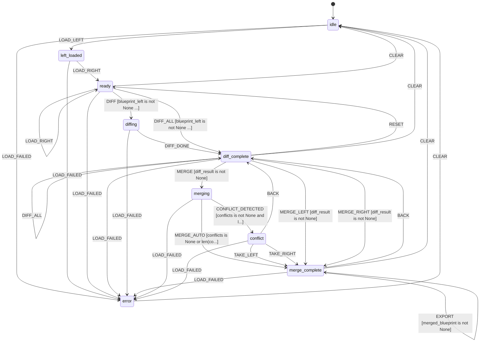

# L++ Blueprint Diff & Merge Tool

Semantic diff and merge tool for L++ blueprints. Unlike simple JSON text diff,
this tool understands the structure of L++ blueprints and provides meaningful
comparisons at the state machine level.

## Features

### Diff Features
- **State Diff**: Detect added/removed/modified states
- **Transition Diff**: Detect added/removed/modified transitions (by ID)
- **Gate Diff**: Detect added/removed/modified gates
- **Action Diff**: Detect added/removed/modified actions
- **Context Schema Diff**: Detect added/removed/modified properties
- **Entry/Terminal State Changes**: Detect changes to entry_state or terminal_states

### Output Formats
- **Unified diff**: Color-coded unified format showing +/- changes
- **Summary**: Statistics (added/removed/modified counts by element type)
- **JSON Patch**: RFC 6902 compliant patch operations

### Merge Features
- **Auto-merge**: Automatically merge non-conflicting changes
- **Conflict detection**: Identify when both versions modify the same element
- **Conflict resolution strategies**:
  - `take_left`: Prefer first blueprint on conflicts
  - `take_right`: Prefer second blueprint on conflicts
  - `manual`: Output conflicts for user resolution
- **Three-way merge**: Use common ancestor for smarter merging

## Usage

### Interactive Mode

```bash
cd utils/blueprint_differ
python3 interactive.py
```

### Command-line Diff

```bash
python3 interactive.py path/to/left.json path/to/right.json
```

### Commands

```
Loading:
  left <path>     - Load left (base) blueprint
  right <path>    - Load right (target) blueprint
  base <path>     - Load common ancestor for 3-way merge

Diffing:
  diff            - Compute semantic diff
  summary         - Show diff summary
  unified         - Show unified diff format
  patch           - Show JSON patch (RFC 6902)
  show            - Display current diff/merge result

Merging:
  merge           - Start merge (detects conflicts)
  merge_left      - Force merge, prefer left on conflicts
  merge_right     - Force merge, prefer right on conflicts
  take_left       - Resolve conflicts by taking left
  take_right      - Resolve conflicts by taking right
  merged          - Show merged blueprint
  export <path>   - Export merged blueprint to file

Navigation:
  back            - Go back to previous state
  reset           - Reset to ready state
  clear           - Clear all loaded blueprints
  state           - Show full context state

Other:
  self            - Diff the differ against itself
  help            - Show this help
  quit            - Exit
```

## Programmatic Usage

```python
from src.differ_compute import (
    load_blueprint,
    compute_diff,
    format_diff,
    generate_json_patch,
    detect_conflicts,
    merge_blueprints,
    export_merged
)

# Load blueprints
left = load_blueprint({'path': 'original.json', 'side': 'left'})
right = load_blueprint({'path': 'modified.json', 'side': 'right'})

# Compute diff
diff = compute_diff({'left': left['blueprint'], 'right': right['blueprint']})

# Format output
result = format_diff({
    'diff': diff['diff'],
    'format': 'unified',  # or 'summary'
    'path_left': 'original.json',
    'path_right': 'modified.json'
})
print(result['output'])

# Generate JSON patch
patch = generate_json_patch({'diff': diff['diff']})
print(patch['formatted'])

# Merge
conflicts = detect_conflicts({
    'left': left['blueprint'],
    'right': right['blueprint'],
    'diff': diff['diff']
})

merged = merge_blueprints({
    'left': left['blueprint'],
    'right': right['blueprint'],
    'strategy': 'auto',
    'conflicts': conflicts['conflicts']
})

# Export
export_merged({
    'blueprint': merged['merged'],
    'path': 'merged.json'
})
```

## State Machine


> **Interactive View:** [Open zoomable diagram](results/blueprint_differ_diagram.html) for pan/zoom controls


## State Machine Visualization

Interactive state machine diagram: [blueprint_differ_graph.html](results/blueprint_differ_graph.html)

Open the HTML file in a browser for:
- Zoom/pan navigation
- Click nodes to highlight connections
- Hover for gate conditions
- Multiple layout options (hierarchical, horizontal, circular, grid)

## Compute Functions

| Function | Description |
|----------|-------------|
| `load_blueprint` | Load an L++ blueprint from a JSON file |
| `clear_all` | Clear all loaded blueprints and diff results |
| `compute_diff` | Compute semantic diff between two blueprints |
| `format_diff` | Format diff for display (unified or summary) |
| `generate_json_patch` | Generate RFC 6902 JSON patch from diff |
| `detect_conflicts` | Detect merge conflicts between blueprints |
| `merge_blueprints` | Merge two blueprints with specified strategy |
| `export_merged` | Export merged blueprint to file |

## Element Types Compared

| Element Type | Description |
|--------------|-------------|
| `state` | State definitions in the state machine |
| `transition` | Transitions between states (matched by ID) |
| `gate` | Guard conditions for transitions |
| `action` | Side-effect definitions (SET, COMPUTE, EMIT) |
| `context_property` | Properties in context_schema |
| `entry_state` | The starting state |
| `terminal_state` | Exit states |
| `metadata` | Blueprint metadata (id, name, version, etc.) |

## File Structure

```
blueprint_differ/
  blueprint_differ.json  # L++ blueprint for the differ itself
  interactive.py         # CLI interface
  README.md              # This file
  src/
    __init__.py          # Package exports
    differ_compute.py    # Compute functions
  results/
    blueprint_differ_compiled.py  # Compiled operator
    blueprint_differ_graph.html   # Interactive visualization
  tla/
    lpp_blueprint_differ.tla      # TLA+ specification
    lpp_blueprint_differ.cfg      # TLA+ config
```

## Examples

### Diff Two Blueprints

```bash
python3 interactive.py

> left utils/visualizer/visualizer.json
> right utils/linter/blueprint_linter.json
> diff
```

### Export JSON Patch

```bash
> left original.json
> right modified.json
> diff
> patch
```

### Merge with Conflict Resolution

```bash
> left base.json
> right feature.json
> base common_ancestor.json  # Optional for 3-way merge
> diff
> merge
> take_right  # or take_left
> export merged.json
```
