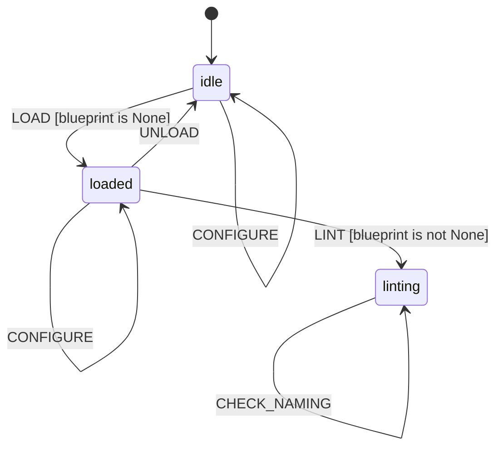

# L++ Blueprint Linter

A static analysis tool for L++ blueprints. Detects issues, suggests improvements, and computes complexity metrics.

## Overview

The Blueprint Linter is itself an L++ state machine, demonstrating the framework's ability to build tools that analyze L++ blueprints.

## Linting Rules

| Code | Severity | Description |
|------|----------|-------------|
| L001 | Warning | Unreachable States - States with no incoming transitions (except entry_state) |
| L002 | Warning | Dead-End States - Non-terminal states with no outgoing transitions |
| L003 | Info | Unused Gates - Gates defined but never referenced |
| L004 | Info | Unused Actions - Actions defined but never referenced |
| L005 | Info | Unused Context - Context properties never used in gates/actions |
| L006 | Error | Orphaned Transitions - Transitions referencing non-existent states |
| L007 | Error | Missing Gate References - Transitions referencing non-existent gates |
| L008 | Error | Missing Action References - Transitions referencing non-existent actions |
| L009 | Error | Duplicate Transition IDs - Multiple transitions with same ID |
| L010 | Info | Naming Conventions - snake_case for IDs, UPPER_CASE for events |

## Metrics

The linter computes the following complexity metrics:

- **State Count**: Number of states in the blueprint
- **Transition Count**: Number of transitions
- **Gate Count**: Number of gate definitions
- **Action Count**: Number of action definitions
- **Event Count**: Number of unique events
- **Context Property Count**: Number of context schema properties
- **Cyclomatic Complexity**: E - N + 2 (edges - nodes + 2)

## Usage

### Command Line

```bash
# Lint a specific blueprint
python interactive.py /path/to/blueprint.json

# Interactive mode
python interactive.py
```

### Interactive Commands

| Command | Description |
|---------|-------------|
| `load <path>` | Load a blueprint for linting |
| `lint` | Run all lint checks |
| `self` | Lint the linter itself (meta!) |
| `report` | Show the full lint report |
| `findings` | Show detailed findings |
| `metrics` | Show complexity metrics |
| `state` | Show full context state (debug) |
| `unload` | Unload current blueprint |
| `clear` | Clear error state |
| `quit` | Exit |

## State Machine


> **Interactive View:** [Open zoomable diagram](results/blueprint_linter_diagram.html) for pan/zoom controls


## Architecture

```
blueprint_linter/
  blueprint_linter.json   # L++ state machine definition
  interactive.py          # CLI interface (thin wrapper)
  README.md
  src/
    __init__.py           # Exports LINT_REGISTRY
    linter_compute.py     # Hermetic compute functions
  results/
    *.py                  # Compiled operators (generated)
```

## Report Format

The linter produces a structured report with:

1. **Header**: Blueprint name, version, ID, and path
2. **Summary**: Count of errors, warnings, and info findings
3. **Metrics**: Complexity metrics for the blueprint
4. **Findings**: Detailed list of issues grouped by severity

Example output:

```
======================================================================
  L++ Blueprint Linter Report
======================================================================

  Blueprint: My Blueprint (v1.0.0)
  ID: my_blueprint
  Path: /path/to/blueprint.json

----------------------------------------------------------------------
  SUMMARY
----------------------------------------------------------------------
  Errors:   0
  Warnings: 2
  Info:     3
  Total:    5

----------------------------------------------------------------------
  METRICS
----------------------------------------------------------------------
  States:      5
  Transitions: 12
  Gates:       4
  Actions:     8
  Events:      6
  Context Props: 10
  Cyclomatic Complexity: 9

----------------------------------------------------------------------
  FINDINGS
----------------------------------------------------------------------

  WARNINGS (2)
    [W] L001: State 'orphaned' has no incoming transitions
       Location: states.orphaned
       Suggestion: Add a transition to 'orphaned' or remove it

======================================================================
```

## Development

### Adding New Rules

1. Add a new rule code in `RuleCode` class
2. Implement the check function following the pattern:
   ```python
   def check_my_rule(params: Dict[str, Any]) -> Dict[str, Any]:
       bp = params.get("blueprint", {})
       findings = list(params.get("findings", []))
       # ... check logic ...
       findings.append(make_finding(...))
       return {"findings": findings}
   ```
3. Register in `COMPUTE_REGISTRY`
4. Add action and transition in `blueprint_linter.json`

### Testing

```bash
# Lint the visualizer
python interactive.py ../visualizer/visualizer.json

# Self-lint
python interactive.py blueprint_linter.json
```

## Interactive Graph

An interactive visualization of the linter state machine is available at:
`results/blueprint_linter_graph.html`

Open this file in a browser to explore the state machine visually.
