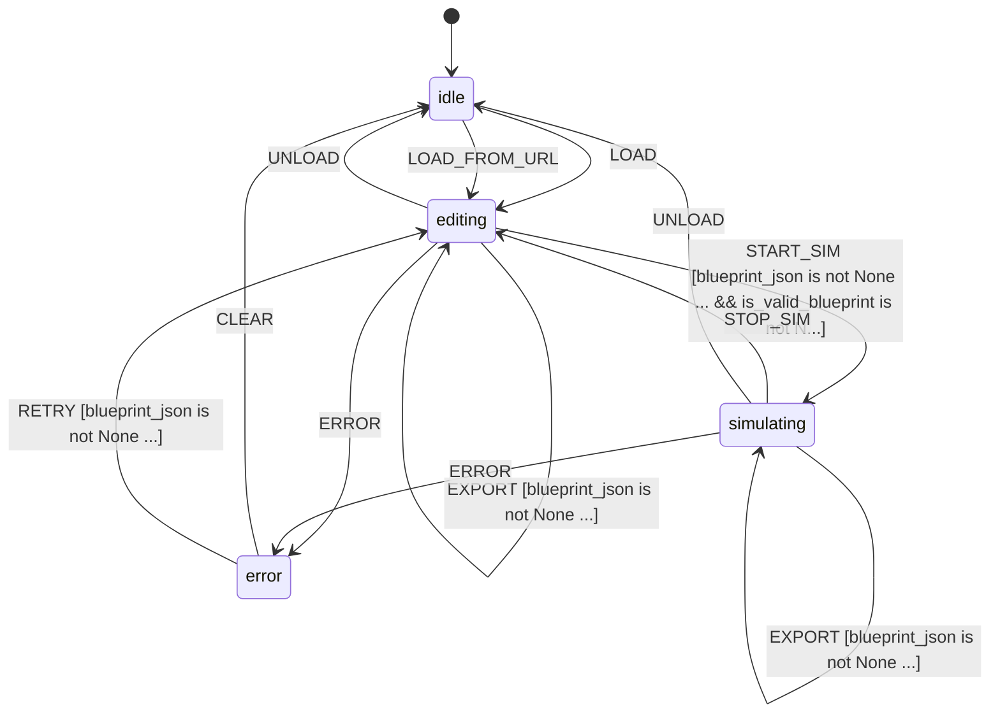

# L++ Blueprint Playground

Interactive web-based environment for editing and testing L++ blueprints.

## Overview

The Blueprint Playground provides a comprehensive development environment for L++ blueprints with:

- **JSON Editor** - Syntax highlighting, live validation, auto-formatting
- **Live Visualization** - Mermaid state diagrams that update as you edit
- **Interactive Simulation** - Run simulations, dispatch events, view state changes
- **Sharing** - Generate shareable URLs with base64-encoded blueprints

## Quick Start

```bash
# Start the web server
python interactive.py

# Start on a specific port
python interactive.py -p 8080

# CLI mode for testing
python interactive.py -c
```

## State Machine Diagram


> **Interactive View:** [Open zoomable diagram](results/blueprint_playground_diagram.html) for pan/zoom controls


## Features

### Editor Features

| Feature | Description |
|---------|-------------|
| Syntax Highlighting | JSON syntax highlighting with error indicators |
| Live Validation | Real-time JSON and schema validation |
| Auto-Formatting | One-click JSON prettification |
| Schema Hints | Visual indicators for L++ schema compliance |

### Visualization

| Feature | Description |
|---------|-------------|
| Mermaid Diagrams | Live state machine diagrams |
| State Highlighting | Current state highlighted during simulation |
| Auto-Update | Diagram updates as you edit |

### Simulation

| Feature | Description |
|---------|-------------|
| Event Dispatch | Click buttons to dispatch events |
| State Tracking | See current state and available events |
| Context Display | View context values in real-time |
| Execution Trace | Full history of state transitions |

### Sharing

| Feature | Description |
|---------|-------------|
| URL Encoding | Base64 + compression for compact URLs |
| Import from URL | Load blueprints from shared URLs |
| File Export | Download blueprints as JSON files |

## Compute Functions

| Function | Description |
|----------|-------------|
| `play:load_blueprint` | Load blueprint from JSON string or file |
| `play:validate_json` | Validate JSON syntax |
| `play:validate_blueprint` | Validate blueprint structure against L++ schema |
| `play:format_blueprint` | Format/prettify JSON |
| `play:generate_diagram` | Generate Mermaid diagram code |
| `play:init_simulation` | Initialize simulation at entry state |
| `play:dispatch_event` | Dispatch event and process transition |
| `play:get_available_events` | Get events available in current state |
| `play:encode_share_url` | Encode blueprint as shareable URL |
| `play:decode_share_url` | Decode blueprint from URL |
| `play:export_blueprint` | Export blueprint to file |

## States

| State | Description |
|-------|-------------|
| `idle` | No blueprint loaded, waiting for input |
| `editing` | Blueprint loaded and being edited |
| `validating` | Validating blueprint JSON/structure |
| `simulating` | Running interactive simulation |
| `serving` | Web server is running |
| `error` | Error state |

## Transitions

| ID | From | To | Event | Description |
|----|------|-----|-------|-------------|
| `t_load_from_idle` | idle | editing | LOAD | Load a new blueprint |
| `t_load_from_url` | idle | editing | LOAD_FROM_URL | Import from share URL |
| `t_reload` | editing | editing | LOAD | Reload/replace blueprint |
| `t_update` | editing | editing | UPDATE | Update JSON content |
| `t_validate` | editing | editing | VALIDATE | Run validation |
| `t_format` | editing | editing | FORMAT | Format JSON |
| `t_start_simulation` | editing | simulating | START_SIM | Start simulation |
| `t_dispatch_event` | simulating | simulating | DISPATCH | Dispatch event |
| `t_reset_simulation` | simulating | simulating | RESET_SIM | Reset simulation |
| `t_stop_simulation` | simulating | editing | STOP_SIM | Stop simulation |
| `t_share` | editing | editing | SHARE | Generate share URL |
| `t_export` | editing | editing | EXPORT | Export to file |

## API Endpoints

When running the web server, these API endpoints are available:

| Endpoint | Method | Description |
|----------|--------|-------------|
| `/` | GET | Serve playground HTML |
| `/api/health` | GET | Health check |
| `/api/validate` | POST | Validate blueprint |
| `/api/validate_json` | POST | Validate JSON syntax |
| `/api/format` | POST | Format JSON |
| `/api/diagram` | POST | Generate Mermaid diagram |
| `/api/init_sim` | POST | Initialize simulation |
| `/api/dispatch` | POST | Dispatch event |
| `/api/events` | POST | Get available events |
| `/api/share` | POST | Generate share URL |
| `/api/import` | POST | Import from URL |
| `/api/load` | POST | Load blueprint |
| `/api/export` | POST | Export blueprint |

## File Structure

```
blueprint_playground/
  blueprint_playground.json    # L++ blueprint definition
  interactive.py               # CLI and web server
  README.md                    # This file
  src/
    __init__.py                # Exports PLAY_REGISTRY
    playground_compute.py      # Compute functions
  templates/
    playground.html            # Web interface
  results/
    blueprint_playground_compiled.py  # Compiled operator
    blueprint_playground_graph.html   # Interactive graph
```

## Usage Examples

### Load and Validate a Blueprint

```python
from src.playground_compute import load_blueprint, validate_blueprint

# Load from file
result = load_blueprint({"file_path": "my_blueprint.json"})
print(result["blueprint_name"])

# Validate
validation = validate_blueprint({"blueprint_json": result["blueprint_json"]})
print(validation["result"]["errors"])
```

### Generate Share URL

```python
from src.playground_compute import encode_share_url

result = encode_share_url({
    "blueprint_json": '{"id": "test", ...}',
    "base_url": "https://my-playground.example.com"
})
print(result["url"])
```

### Run Simulation

```python
from src.playground_compute import init_simulation, dispatch_event

# Initialize
sim = init_simulation({"blueprint": blueprint})
print(f"Starting at: {sim['sim_state']}")
print(f"Available events: {sim['available_events']}")

# Dispatch event
result = dispatch_event({
    "blueprint": blueprint,
    "sim_state": sim["sim_state"],
    "sim_context": sim["sim_context"],
    "sim_trace": sim["trace"],
    "event_name": "START"
})
print(result["output"])
```

## Sample Blueprints

The playground includes sample blueprints for learning:

1. **Counter** - Simple increment/decrement state machine
2. **Traffic Light** - Cyclic state transitions
3. **Order Flow** - E-commerce order processing with terminal states

## L++ Schema Reference

The playground validates against L++ Schema v0.1.2. Key requirements:

- `$schema`: Should be "lpp/v0.1.2"
- `id`: Unique identifier (required)
- `states`: Object with state definitions (required)
- `transitions`: Array of transition definitions (required)
- `entry_state`: Starting state ID (required)
- `gates`: Object with gate definitions (optional)
- `actions`: Object with action definitions (optional)
- `terminal_states`: Array of terminal state IDs (optional)

---

Generated by L++ Blueprint Playground v1.0.0
