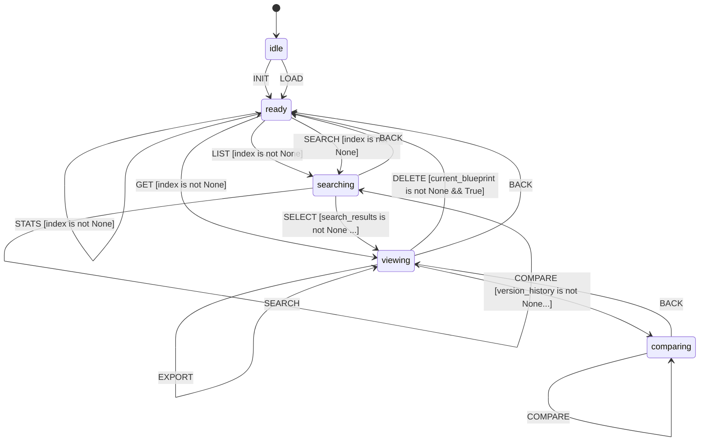

# L++ Blueprint Registry

Centralized blueprint management with version control, dependency tracking, and discovery for L++ workflows.

## Overview

The Blueprint Registry provides:
- **Blueprint Registration**: Add blueprints to a centralized registry with metadata
- **Version Control**: Semantic versioning, version history, rollback support
- **Dependency Tracking**: Track and visualize blueprint dependencies
- **Search and Discovery**: Search by name, tags, description
- **Lifecycle Management**: Deprecation and deletion with dependency checks

## Usage

### Interactive Mode

```bash
cd utils/blueprint_registry
python interactive.py
```

### With Default Registry

The registry auto-loads from `./registry/` if it exists:

```bash
python interactive.py
# Registry automatically loaded
```

## Commands

### Registry Management

| Command | Description |
|---------|-------------|
| `init [path]` | Initialize new registry |
| `load [path]` | Load existing registry |
| `stats` | Show registry statistics |
| `export [json/markdown]` | Export registry metadata |

### Blueprint Operations

| Command | Description |
|---------|-------------|
| `register <path> [--tags t1,t2] [--owner name]` | Register blueprint |
| `update <id> <path> [major/minor/patch]` | Update with version bump |
| `get <id> [version]` | View blueprint details |
| `list [tag]` | List all blueprints |
| `search <query>` | Search blueprints |
| `deprecate [reason]` | Mark as deprecated |
| `delete` | Delete blueprint |

### Version Control

| Command | Description |
|---------|-------------|
| `versions` | Show version history |
| `compare <v1> <v2>` | Compare two versions |
| `rollback <version>` | Rollback to previous version |

### Dependency Management

| Command | Description |
|---------|-------------|
| `deps` | Show dependency graph |

## Registry Index Format

```json
{
  "version": "1.0.0",
  "created_at": "2024-01-01T00:00:00Z",
  "updated_at": "2024-03-15T12:00:00Z",
  "blueprints": {
    "lpp_visualizer": {
      "current_version": "1.1.0",
      "versions": ["1.0.0", "1.0.1", "1.1.0"],
      "description": "L++ Blueprint Visualizer",
      "name": "L++ Blueprint Visualizer",
      "tags": ["visualization", "core"],
      "dependencies": [],
      "deprecated": false,
      "deprecated_reason": null,
      "created_at": "2024-01-01T00:00:00Z",
      "updated_at": "2024-03-15T12:00:00Z",
      "owner": "lpp-team",
      "source_path": "/path/to/visualizer.json"
    }
  }
}
```

## Version Control

### Semantic Versioning

The registry uses semantic versioning (major.minor.patch):

- **major**: Breaking changes
- **minor**: New features, backward compatible
- **patch**: Bug fixes

### Version Bumping

```bash
# Patch bump (default): 1.0.0 -> 1.0.1
> update lpp_visualizer ./visualizer.json

# Minor bump: 1.0.0 -> 1.1.0
> update lpp_visualizer ./visualizer.json minor

# Major bump: 1.0.0 -> 2.0.0
> update lpp_visualizer ./visualizer.json major
```

### Rollback

```bash
# Get version history
> versions

# Rollback to previous version
> rollback 1.0.0
```

## Dependency Management

### Automatic Detection

Dependencies are extracted from blueprint actions with external compute units:

```json
{
  "type": "compute",
  "compute_unit": "external_blueprint:function"
}
```

### Dependency Graph

```bash
> deps

  Dependency Graph for lpp_composer:
  --------------------------------------------------
  Dependencies:
    lpp_composer -> lpp_visualizer [OK]
    lpp_composer -> lpp_linter [OK]

  Depended on by:
    <- lpp_playground
```

### Circular Dependency Detection

The registry automatically checks for circular dependencies during validation.

## Example Workflow

```bash
# Initialize registry
> init ./registry

# Register a blueprint
> register ../visualizer/visualizer.json --tags visualization,core --owner lpp-team

# List all blueprints
> list

# Search for visualization tools
> search visual

# View details
> get lpp_visualizer

# Show version history
> versions

# Update with new version
> update lpp_visualizer ../visualizer/visualizer.json minor

# Compare versions
> compare 1.0.0 1.1.0

# Export registry
> export markdown
```

## State Machine


> **Interactive View:** [Open zoomable diagram](results/blueprint_registry_diagram.html) for pan/zoom controls


## State Machine Visualization

Interactive state machine diagram: [blueprint_registry_graph.html](results/blueprint_registry_graph.html)

Open the HTML file in a browser for:
- Zoom/pan navigation
- Click nodes to highlight connections
- Hover for gate conditions
- Multiple layout options

## Files

| File | Description |
|------|-------------|
| `blueprint_registry.json` | L++ blueprint defining the registry state machine |
| `src/__init__.py` | Exports BPREG_REGISTRY |
| `src/registry_compute.py` | Compute functions for registry operations |
| `interactive.py` | CLI interface |
| `registry/` | Default registry storage location |
| `registry/index.json` | Registry index file |
| `registry/versions/` | Versioned blueprint storage |

## Compute Functions

| Function | Description |
|----------|-------------|
| `init_registry` | Initialize empty registry |
| `load_registry` | Load registry index |
| `save_registry` | Save registry index |
| `register_blueprint` | Register new blueprint |
| `update_blueprint` | Update existing blueprint |
| `get_blueprint` | Get blueprint by ID and version |
| `list_blueprints` | List all blueprints |
| `search_blueprints` | Search by query |
| `get_versions` | Get version history |
| `compare_versions` | Compare two versions |
| `rollback_version` | Rollback to previous version |
| `get_dependencies` | Get dependency tree |
| `check_circular_deps` | Check for circular dependencies |
| `deprecate_blueprint` | Mark as deprecated |
| `delete_blueprint` | Remove from registry |
| `export_registry` | Export registry metadata |
| `get_stats` | Get registry statistics |

## Testing

```bash
# Start the interactive shell
python interactive.py

# Initialize and test
> init
> register ../visualizer/visualizer.json --tags viz,core
> list
> search visual
> get lpp_visualizer
> versions
```
