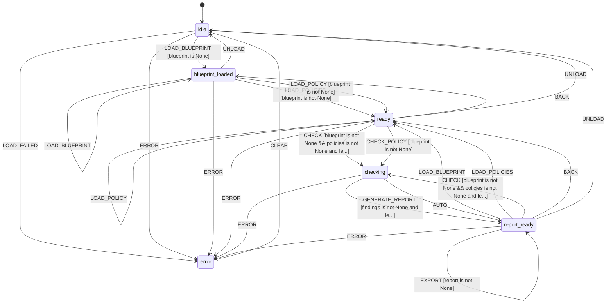

# L++ Compliance Checker

A deterministic compliance verification tool for L++ blueprints. Verifies workflows against configurable policies for security, audit, data validation, and workflow requirements.

## Overview

The Compliance Checker is itself an L++ blueprint that demonstrates the framework's meta-capabilities. It loads blueprints and policies, evaluates rules, generates reports, and exports findings - all through a state machine defined in JSON.

## Features

- **Policy-Based Verification**: Check blueprints against configurable compliance policies
- **Multiple Rule Types**: Support for state existence, gate requirements, action requirements, and more
- **Compliance Scoring**: Calculate percentage-based compliance scores
- **Detailed Reports**: Generate reports in JSON, Markdown, or text format
- **Remediation Guidance**: Provides actionable fix suggestions for violations

## State Machine


> **Interactive View:** [Open zoomable diagram](results/compliance_checker_diagram.html) for pan/zoom controls


## Usage

### Interactive CLI

```bash
cd utils/compliance_checker
python interactive.py [blueprint_path]
```

### Commands

| Command | Description |
|---------|-------------|
| `load <path>` | Load a blueprint to check |
| `policies [dir]` | Load policies from directory (default: ./policies) |
| `policy <path>` | Load a single policy file |
| `check` | Run compliance check against all loaded policies |
| `report` | Display the compliance report summary |
| `export [path]` | Export report (supports .json, .md, .txt) |
| `findings` | Show all compliance findings |
| `score` | Display compliance score |
| `state` | Show full context state |
| `back` | Go back to previous state |
| `unload` | Unload blueprint and policies |
| `q/quit` | Exit |

### Example Session

```
> load ../visualizer/visualizer.json
> policies
> check
> report
> export ./report.md
```

## Built-in Policies

### SEC-001: Authentication Required
Ensures sensitive transitions (DELETE, UPDATE, CREATE, ADMIN) have authentication gates.

### AUD-001: Audit Trail Requirements
Requires logging actions on critical transitions and error tracking.

### WF-001: Approval Workflow Patterns
Validates approval/rejection workflows have proper authorization gates.

### DATA-001: Data Validation Requirements
Ensures data operations (SAVE, IMPORT, PROCESS) have validation gates.

## Policy Definition Format

```json
{
  "policy_id": "SEC-001",
  "name": "Authentication Required",
  "description": "All sensitive transitions must have authentication gate",
  "severity": "error",
  "rules": [
    {
      "type": "transition_requires_gate",
      "condition": {
        "on_event_pattern": "^(DELETE|UPDATE|CREATE)_.*"
      },
      "required_gate_pattern": ".*auth.*|.*authenticated.*"
    }
  ]
}
```

## Supported Rule Types

| Rule Type | Description |
|-----------|-------------|
| `state_exists` | Require specific states in the blueprint |
| `transition_requires_gate` | Transitions matching pattern must have a gate |
| `transition_requires_action` | Transitions must have specific actions |
| `gate_expression_check` | Gate expressions must contain patterns |
| `action_type_required` | Require specific action types (set, compute, emit) |
| `context_property_required` | Require properties in context schema |
| `no_direct_transition` | Prevent direct transitions between states |

## Compute Functions

| Function | Description |
|----------|-------------|
| `load_blueprint` | Load blueprint JSON for checking |
| `load_policy` | Load a single policy file |
| `load_policies` | Load all policies from directory |
| `check_policy` | Check blueprint against one policy |
| `check_all_policies` | Check blueprint against all policies |
| `evaluate_rule` | Evaluate a single rule |
| `generate_report` | Generate compliance report |
| `calculate_score` | Calculate compliance score |
| `export_report` | Export report to file |

## Compliance Report

Reports include:
- **Summary**: Pass/Fail count by severity
- **Score**: Percentage-based compliance score (0-100)
- **Status**: PASS (>=80%), WARNING (>=50%), FAIL (<50%)
- **Findings**: Detailed findings grouped by severity and policy
- **Remediations**: Actionable fix suggestions

## Directory Structure

```
compliance_checker/
  compliance_checker.json    # L++ blueprint
  interactive.py             # CLI interface
  README.md                  # This file
  src/
    __init__.py              # Registry exports
    compliance_compute.py    # Compute functions
  policies/
    security_auth.json       # SEC-001
    audit_logging.json       # AUD-001
    workflow_approval.json   # WF-001
    data_validation.json     # DATA-001
  results/
    compliance_checker_compiled.py
    compliance_checker_graph.html
  tla/
    compliance_checker.tla   # TLA+ specification
    compliance_checker.cfg   # TLA+ config
```

## State Machine Visualization

Interactive state machine diagram: [compliance_checker_graph.html](results/compliance_checker_graph.html)

Open the HTML file in a browser for:
- Zoom/pan navigation
- Click nodes to highlight connections
- Hover for gate conditions
- Multiple layout options (hierarchical, horizontal, circular, grid)
