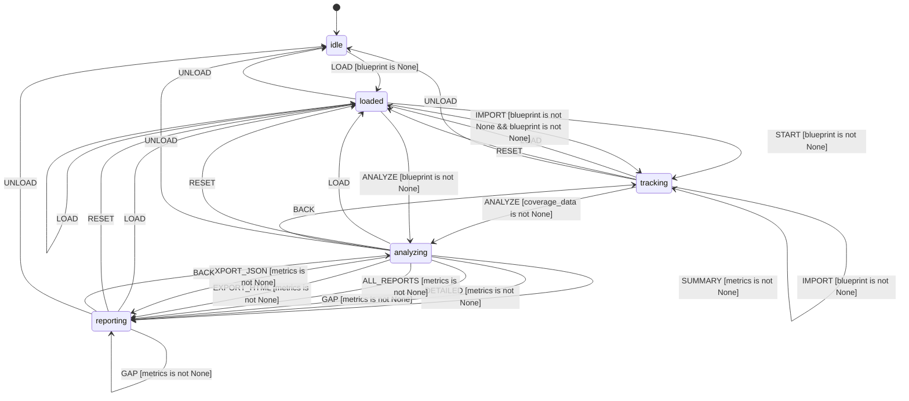

# L++ Coverage Analyzer

Tracks runtime coverage of blueprints during execution

**Version:** 1.0.0  
**ID:** `coverage_analyzer`

## State Machine

> **Interactive View:** [Open zoomable diagram](results/coverage_analyzer_diagram.html) for pan/zoom controls

## States

| State | Description |
|-------|-------------|
| ● `idle` | No blueprint loaded, waiting for input |
| `loaded` | Blueprint loaded, coverage tracking initialized |
| `tracking` | Actively tracking coverage data |
| `analyzing` | Computing coverage metrics |
| `reporting` | Generating reports |
| `error` | Error state |

## Gates

| Gate | Expression |
|------|------------|
| `has_blueprint` | `blueprint is not None` |
| `no_blueprint` | `blueprint is None` |
| `has_coverage` | `coverage_data is not None` |
| `has_metrics` | `metrics is not None` |
| `has_summary` | `summary_report is not None` |
| `has_detailed` | `detailed_report is not None` |
| `has_gap` | `gap_report is not None` |
| `has_html` | `html_report is not None` |
| `has_json` | `json_report is not None` |
| `has_trace` | `trace_data is not None and len(trace_data) > 0` |
| `is_tracking` | `_state == 'tracking'` |
| `is_loaded` | `_state == 'loaded'` |

## Actions

| Action | Type |
|--------|------|
| `load_blueprint` | compute |
| `init_coverage` | compute |
| `record_state` | compute |
| `record_transition` | compute |
| `record_gate` | compute |
| `record_action` | compute |
| `record_event` | compute |
| `import_trace` | compute |
| `compute_metrics` | compute |
| `generate_summary` | compute |
| `generate_detailed` | compute |
| `generate_gap_report` | compute |
| `export_html` | compute |
| `export_json` | compute |
| `reset_coverage` | compute |
| `clear_all` | compute |
| `set_error` | set |
| `clear_error` | set |

## Transitions

| ID | From | To | Event | Gate | Actions |
|----|------|-----|-------|------|---------|
| `t_load` | idle | loaded | LOAD | - | load_blueprint, init_coverage |
| `t_reload` | loaded | loaded | LOAD | - | clear_all, load_blueprint, init_coverage |
| `t_reload_from_tracking` | tracking | loaded | LOAD | - | clear_all, load_blueprint, init_coverage |
| `t_reload_from_analyzing` | analyzing | loaded | LOAD | - | clear_all, load_blueprint, init_coverage |
| `t_reload_from_reporting` | reporting | loaded | LOAD | - | clear_all, load_blueprint, init_coverage |
| `t_start_tracking` | loaded | tracking | START | - | - |
| `t_record_state` | tracking | tracking | STATE | - | record_state |
| `t_record_transition` | tracking | tracking | TRANSITION | - | record_transition |
| `t_record_gate` | tracking | tracking | GATE | - | record_gate |
| `t_record_action` | tracking | tracking | ACTION | - | record_action |
| `t_record_event` | tracking | tracking | EVENT | - | record_event |
| `t_import_trace_loaded` | loaded | tracking | IMPORT | - | import_trace |
| `t_import_trace_tracking` | tracking | tracking | IMPORT | - | import_trace |
| `t_analyze` | tracking | analyzing | ANALYZE | - | compute_metrics |
| `t_analyze_from_loaded` | loaded | analyzing | ANALYZE | - | compute_metrics |
| `t_summary` | analyzing | reporting | SUMMARY | - | generate_summary |
| `t_detailed` | analyzing | reporting | DETAILED | - | generate_detailed |
| `t_gap` | analyzing | reporting | GAP | - | generate_gap_report |
| `t_all_reports` | analyzing | reporting | ALL_REPORTS | - | generate_summary, generate_detailed, generate_gap_report |
| `t_export_html` | reporting | reporting | EXPORT_HTML | - | export_html |
| `t_export_html_from_analyzing` | analyzing | reporting | EXPORT_HTML | - | export_html |
| `t_export_json` | reporting | reporting | EXPORT_JSON | - | export_json |
| `t_export_json_from_analyzing` | analyzing | reporting | EXPORT_JSON | - | export_json |
| `t_more_summary` | reporting | reporting | SUMMARY | - | generate_summary |
| `t_more_detailed` | reporting | reporting | DETAILED | - | generate_detailed |
| `t_more_gap` | reporting | reporting | GAP | - | generate_gap_report |
| `t_reset` | tracking | loaded | RESET | - | reset_coverage |
| `t_reset_from_analyzing` | analyzing | loaded | RESET | - | reset_coverage |
| `t_reset_from_reporting` | reporting | loaded | RESET | - | reset_coverage |
| `t_back_to_tracking` | analyzing | tracking | BACK | - | - |
| `t_back_to_analyzing` | reporting | analyzing | BACK | - | - |
| `t_unload` | loaded | idle | UNLOAD | - | clear_all |
| `t_unload_from_tracking` | tracking | idle | UNLOAD | - | clear_all |
| `t_unload_from_analyzing` | analyzing | idle | UNLOAD | - | clear_all |
| `t_unload_from_reporting` | reporting | idle | UNLOAD | - | clear_all |
| `t_error` | * | error | ERROR | - | set_error |
| `t_recover` | error | idle | CLEAR | - | clear_error, clear_all |

---

*Generated by L++ README Generator (compiled L++ operator)*