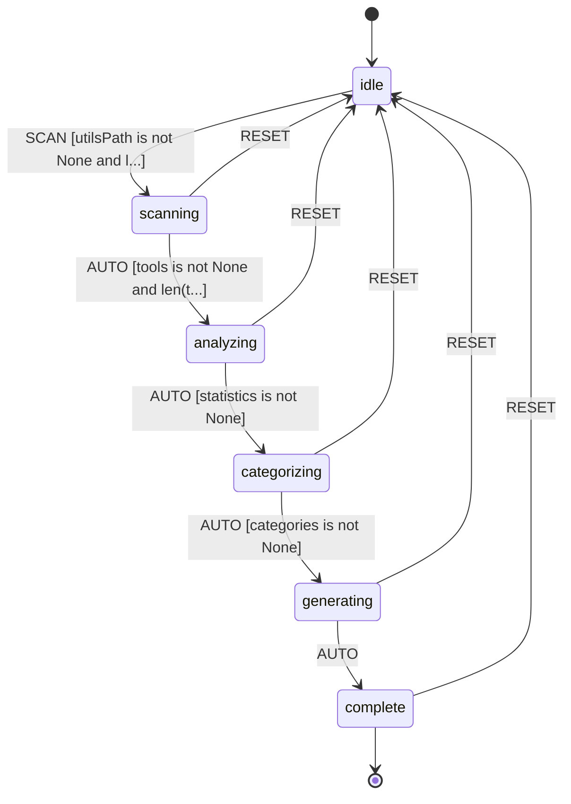

# L++ Tools Dashboard

Aggregates and visualizes all L++ utility tools with interactive search, filtering, and quick access to visualizations.

## Overview

The Dashboard tool scans the `utils/` directory to discover all L++ tool blueprints and generates an interactive HTML dashboard that provides:

- **Tool Overview**: Quick stats for each tool (states, transitions, gates, actions)
- **Category Grouping**: Automatic categorization based on naming patterns
- **Search & Filter**: Full-text search and filter capabilities
- **Visualization Links**: Direct links to all available visualizations
- **Mermaid Previews**: Inline preview of simplified state diagrams
- **Aggregate Statistics**: Overall stats across all tools

## Usage

Generate the dashboard:

```bash
cd utils/dashboard
python interactive.py
```

Or specify a custom utils path:

```bash
python interactive.py /path/to/utils
```

The dashboard is generated at `utils/dashboard.html`.

## State Machine



## Categories

Tools are automatically grouped into these categories based on naming patterns:

| Category | Pattern |
|----------|---------|
| Blueprint Tools | `blueprint_*` |
| Visualization | `graph_`, `diagram` |
| Code Analysis | `decoder`, `extractor`, `analyzer` |
| Testing & Quality | `test_`, `coverage_`, `linter`, `compliance` |
| Documentation | `doc_`, `readme_` |
| Registry & Discovery | `registry`, `skill_` |
| Orchestration | `orchestrator`, `simulator`, `tracer` |
| Research | `research_`, `scholar_` |
| LLM Integration | `llm_` |
| Migration & Schema | `migrator` |
| Verification | `tlaps_`, `seal` |

## Dashboard Features

### Tool Cards

Each tool card displays:
- Tool name and version
- Description from blueprint
- Quick stats (states, transitions, gates, actions)
- Links to available visualizations:
  - State Machine Graph (`*_graph.html`)
  - Logic Graph (`*_logic_graph.html`)
  - Function Dependencies (`*_functions.html`)
  - Mermaid Diagram (`*_diagram.html`)

### Expandable Details

Click a card to expand and see:
- List of all states (entry/terminal highlighted)
- Inline Mermaid state diagram preview
- File paths for blueprint and directory

### Search & Filter

- Full-text search across tool names and descriptions
- Filter by "With Visualizations" or "Blueprint Tools"
- Category sidebar for quick navigation

## Compute Units

| Unit | Description |
|------|-------------|
| `dashboard:scanTools` | Scans utils directory for L++ tool blueprints |
| `dashboard:analyzeTools` | Analyzes blueprints to extract statistics |
| `dashboard:categorizeTools` | Groups tools by naming patterns |
| `dashboard:generateDashboard` | Generates the interactive HTML dashboard |

## State Machine Visualization

Interactive state machine diagram: [dashboard_graph.html](results/dashboard_graph.html)

Open the HTML file in a browser for:
- Zoom/pan navigation
- Click nodes to highlight connections
- Hover for gate conditions
- Multiple layout options (hierarchical, horizontal, circular, grid)
