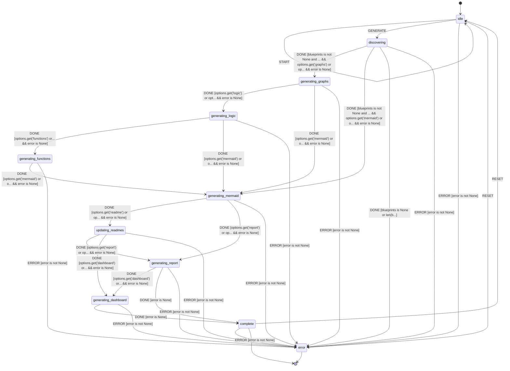

# Documentation Generator

L++ tool for generating all documentation artifacts for L++ blueprints.

**Version:** 1.0.0  
**Schema:** L++ v0.1.2

## Overview

The Documentation Generator consolidates all documentation generation into a single L++ tool with a simple deployment script. It generates:

- **Graph Visualizations** - Interactive HTML state machine diagrams
- **Logic Graphs** - Decoded from Python source code
- **Function Graphs** - Function dependency visualizations
- **Mermaid Diagrams** - Both detailed and simplified versions
- **README Updates** - Embeds Mermaid diagrams in READMEs
- **Analysis Reports** - Aggregate statistics across all tools
- **Dashboard** - Interactive HTML dashboard

## Usage

### Quick Deploy (Recommended)

From the project root:

```bash
./deploy.sh              # Generate all documentation
./deploy.sh mermaid      # Generate only Mermaid diagrams
./deploy.sh dashboard    # Generate only dashboard
./deploy.sh clean        # Remove generated artifacts
```

### Direct CLI

```bash
cd utils/doc_generator
python interactive.py --all          # Generate everything
python interactive.py --graphs       # Only HTML graphs
python interactive.py --mermaid      # Only Mermaid diagrams
python interactive.py --readme       # Only update READMEs
```

## State Diagram



## Compute Units

| Unit | Description |
|------|-------------|
| `docgen:init` | Initialize generator state |
| `docgen:discoverBlueprints` | Scan utils/ for blueprints |
| `docgen:generateGraphs` | Generate HTML graph visualizations |
| `docgen:generateLogicGraphs` | Generate logic graphs from Python |
| `docgen:generateFunctionGraphs` | Generate function dependency graphs |
| `docgen:generateMermaid` | Generate Mermaid diagrams (3 versions) |
| `docgen:updateReadmes` | Update README files with diagrams |
| `docgen:generateReport` | Generate analysis report |
| `docgen:generateDashboard` | Generate dashboard HTML |
| `docgen:finalize` | Return generation summary |

## Output Locations

| Artifact | Location |
|----------|----------|
| Graph HTML | `utils/<tool>/results/<tool>_graph.html` |
| Logic Graph | `utils/<tool>/results/<tool>_logic_graph.html` |
| Function Graph | `utils/<tool>/results/<tool>_functions.html` |
| Mermaid (detailed) | `utils/<tool>/results/<tool>.mmd` |
| Mermaid (simple) | `utils/<tool>/results/<tool>_simple.mmd` |
| Mermaid (zoomable) | `utils/<tool>/results/<tool>_diagram.html` |
| Analysis Report | `utils/analysis_report.md` |
| Dashboard | `utils/dashboard.html` |
