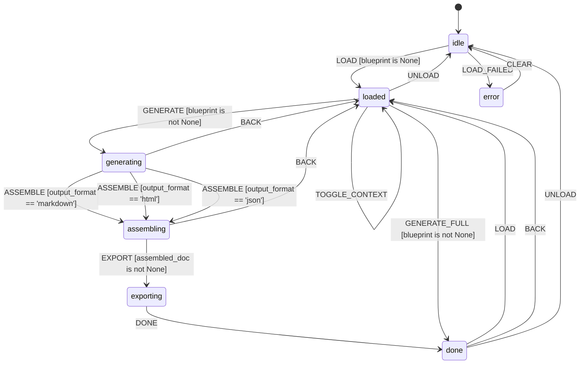

# L++ Documentation Generator

Auto-generates comprehensive documentation from L++ blueprints in multiple formats.

**Version:** 1.0.0
**ID:** `lpp_doc_generator`

## Overview

The Documentation Generator is an L++ tool that produces comprehensive documentation from blueprint JSON files. It supports multiple output formats and configurable sections.

| Property | Value |
|----------|-------|
| **Schema** | lpp/v0.1.2 |
| **Entry State** | `idle` |
| **Terminal States** | _none_ |
| **States** | 7 |
| **Transitions** | 17 |
| **Gates** | 17 |
| **Actions** | 24 |

## Features

### Output Formats
- **Markdown** - README-style documentation with Mermaid diagrams
- **HTML** - Standalone HTML with CSS styling and Mermaid support
- **JSON** - Structured data for programmatic use

### Documentation Sections
- **Overview** - Blueprint name, version, description, statistics
- **Quick Start** - Usage examples and event sequences
- **State Machine Diagram** - Mermaid stateDiagram-v2
- **States Table** - All states with descriptions and types
- **Transitions Table** - All transitions with events, gates, actions
- **Gates Table** - Gate expressions and types
- **Actions Table** - Action types and configurations
- **Context Schema** - Context properties with types and descriptions
- **Events List** - All events and their transitions

### Configurable Options
- `mermaid` - Include state machine diagram
- `tables` - Include detailed tables
- `quickstart` - Include quick-start guide
- `context` - Include context schema documentation

## State Machine


> **Interactive View:** [Open zoomable diagram](results/doc_generator_diagram.html) for pan/zoom controls


## Usage

### Interactive CLI

```bash
cd utils/doc_generator
python interactive.py [blueprint.json]
```

### Commands

| Command | Description |
|---------|-------------|
| `load <path>` | Load a blueprint JSON file |
| `format <fmt>` | Set output format: markdown, html, json |
| `mermaid` | Toggle mermaid diagram inclusion |
| `tables` | Toggle detailed tables inclusion |
| `quickstart` | Toggle quick-start guide inclusion |
| `context` | Toggle context schema docs inclusion |
| `generate` | Generate all documentation sections |
| `export [path]` | Export documentation to file |
| `full [path]` | Generate and export in one step |
| `back` | Go back to previous state |
| `unload` | Unload current blueprint |
| `state` | Show current context |
| `help` | Show help |
| `quit` | Exit |

### Example Session

```
> load ../visualizer/visualizer.json
  [+] [loaded] L++ Blueprint Visualizer (markdown) [mermaid, tables, quickstart, context]

> format html
  [+] [loaded] L++ Blueprint Visualizer (html) [mermaid, tables, quickstart, context]

> full ./output/visualizer_docs.html
  [!] [done] Done! Exported to: /path/to/output/visualizer_docs.html
```

### Programmatic Usage

```python
from src import DOC_REGISTRY
from frame_py.compiler import compile_blueprint
import importlib.util

# Compile
compile_blueprint('doc_generator.json', 'compiled.py')

# Load operator
spec = importlib.util.spec_from_file_location('op', 'compiled.py')
mod = importlib.util.module_from_spec(spec)
spec.loader.exec_module(mod)

reg = {tuple(k.split(':')): fn for k, fn in DOC_REGISTRY.items()}
op = mod.create_operator(reg)

# Generate documentation
op.dispatch('LOAD', {'path': 'my_blueprint.json'})
op.dispatch('GENERATE')
op.dispatch('ASSEMBLE')
op.dispatch('EXPORT', {'path': './docs/my_blueprint_docs.md'})
op.dispatch('DONE')

print(f"Exported to: {op.context['output_path']}")
```

## States

| State | Type | Description |
|-------|------|-------------|
| `idle` | Entry | No blueprint loaded, waiting for input |
| `loaded` | Normal | Blueprint loaded, ready to generate docs |
| `generating` | Normal | Actively generating documentation sections |
| `assembling` | Normal | Assembling all sections into final document |
| `exporting` | Normal | Exporting documentation to file |
| `done` | Normal | Documentation generation complete |
| `error` | Normal | Error state |

## Events

| Event | Description |
|-------|-------------|
| `LOAD` | Load a blueprint file |
| `LOAD_FAILED` | Blueprint loading failed |
| `FORMAT_MARKDOWN` | Set output to markdown |
| `FORMAT_HTML` | Set output to HTML |
| `FORMAT_JSON` | Set output to JSON |
| `TOGGLE_MERMAID` | Toggle mermaid inclusion |
| `TOGGLE_TABLES` | Toggle tables inclusion |
| `TOGGLE_QUICKSTART` | Toggle quickstart inclusion |
| `TOGGLE_CONTEXT` | Toggle context docs inclusion |
| `GENERATE` | Generate all sections |
| `ASSEMBLE` | Assemble final document |
| `EXPORT` | Export to file |
| `DONE` | Mark generation complete |
| `GENERATE_FULL` | Generate and export in one step |
| `BACK` | Return to previous state |
| `UNLOAD` | Unload blueprint |
| `CLEAR` | Clear error state |

## Compute Units

| Unit | Description |
|------|-------------|
| `doc:load_blueprint` | Load and parse blueprint JSON |
| `doc:init_defaults` | Initialize default options |
| `doc:toggle` | Toggle boolean option |
| `doc:clear_sections` | Clear generated sections |
| `doc:extract_metadata` | Extract blueprint metadata |
| `doc:generate_overview` | Generate overview section |
| `doc:generate_mermaid` | Generate state diagram |
| `doc:generate_states_table` | Generate states documentation |
| `doc:generate_transitions_table` | Generate transitions table |
| `doc:generate_gates_table` | Generate gates documentation |
| `doc:generate_actions_table` | Generate actions documentation |
| `doc:generate_context_docs` | Generate context schema docs |
| `doc:generate_events_list` | Generate events list |
| `doc:generate_quickstart` | Generate quick-start guide |
| `doc:assemble_markdown` | Assemble markdown document |
| `doc:assemble_html` | Assemble HTML document |
| `doc:assemble_json` | Assemble JSON document |
| `doc:export_docs` | Export to file |

## Context Schema

| Property | Type | Description |
|----------|------|-------------|
| `blueprint` | object | The loaded Blueprint object |
| `blueprint_path` | string | Path to the loaded blueprint |
| `blueprint_name` | string | Blueprint name |
| `blueprint_id` | string | Blueprint ID |
| `output_format` | string | Output format: markdown, html, json |
| `output_path` | string | Path where docs were exported |
| `metadata` | object | Extracted metadata |
| `overview_section` | string | Generated overview section |
| `mermaid_section` | string | Generated mermaid diagram |
| `states_section` | string | Generated states documentation |
| `transitions_section` | string | Generated transitions table |
| `gates_section` | string | Generated gates documentation |
| `actions_section` | string | Generated actions documentation |
| `context_section` | string | Generated context schema docs |
| `events_section` | string | Generated events documentation |
| `quickstart_section` | string | Generated quick-start guide |
| `assembled_doc` | string | Fully assembled documentation |
| `include_mermaid` | boolean | Include mermaid diagram |
| `include_tables` | boolean | Include detailed tables |
| `include_quickstart` | boolean | Include quick-start guide |
| `include_context` | boolean | Include context schema docs |
| `error` | string | Error message if any |

---

_Generated by L++ build_skill.sh_
