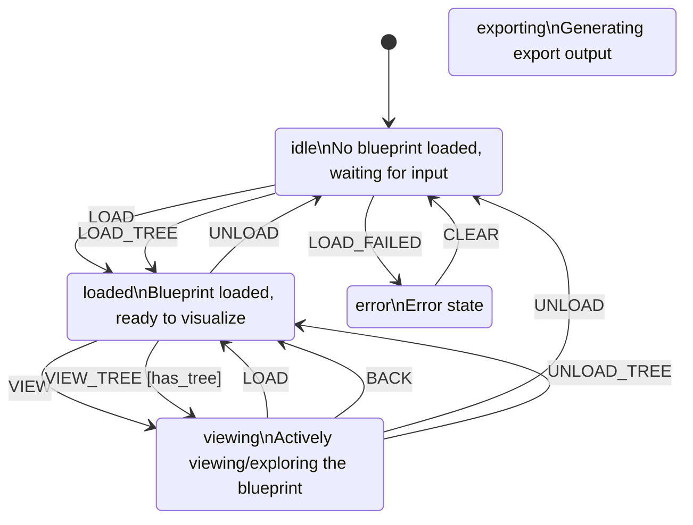

# L++ Blueprint Visualizer

L++ visualizing itself - a meta-example demonstrating self-reference

## Overview

| Property | Value |
|----------|-------|
| **ID** | `lpp_visualizer` |
| **Version** | 1.1.0 |
| **Schema** | lpp/v0.1.2 |
| **Entry State** | `idle` |
| **Terminal States** | _none_ |
| **States** | 5 |
| **Transitions** | 26 |
| **Gates** | 18 |
| **Actions** | 26 |

## Quick Start Guide

### Basic Usage

```python
# Load and compile the blueprint
from frame_py.compiler import compile_blueprint

compile_blueprint("lpp_visualizer.json", "compiled.py")

# Create operator instance
from compiled import create_operator
op = create_operator(compute_registry)

# Dispatch events
op.dispatch("YOUR_EVENT_HERE")
```

### Example Event Sequences

_No example paths found._

## State Machine Diagram



## States

| State | Type | Description |
|-------|------|-------------|
| `idle` | Entry | No blueprint loaded, waiting for input |
| `loaded` | Normal | Blueprint loaded, ready to visualize |
| `viewing` | Normal | Actively viewing/exploring the blueprint |
| `exporting` | Normal | Generating export output |
| `error` | Normal | Error state |

## Transitions

| ID | From | To | Event | Gate(s) | Action(s) |
|----|------|-----|-------|---------|-----------|
| `t_load` | `idle` | `loaded` | `LOAD` | - | load_blueprint, init_defaults |
| `t_load_error` | `idle` | `error` | `LOAD_FAILED` | - | set_error |
| `t_reload` | `loaded` | `loaded` | `LOAD` | - | load_blueprint |
| `t_reload_from_viewing` | `viewing` | `loaded` | `LOAD` | - | load_blueprint, clear_selection |
| `t_start_view` | `loaded` | `viewing` | `VIEW` | - | render_graph |
| `t_switch_to_graph` | `viewing` | `viewing` | `VIEW_GRAPH` | - | set_view_graph, render_graph |
| `t_switch_to_table` | `viewing` | `viewing` | `VIEW_TABLE` | - | set_view_table, render_table |
| `t_switch_to_mermaid` | `viewing` | `viewing` | `VIEW_MERMAID` | - | set_view_mermaid, render_mermaid |
| `t_select` | `viewing` | `viewing` | `SELECT` | - | select_node |
| `t_deselect` | `viewing` | `viewing` | `DESELECT` | - | clear_selection |
| `t_zoom_in` | `viewing` | `viewing` | `ZOOM_IN` | - | zoom_in |
| `t_zoom_out` | `viewing` | `viewing` | `ZOOM_OUT` | - | zoom_out |
| `t_toggle_gates` | `viewing` | `viewing` | `TOGGLE_GATES` | - | toggle_gates |
| `t_toggle_actions` | `viewing` | `viewing` | `TOGGLE_ACTIONS` | - | toggle_actions |
| `t_back_to_loaded` | `viewing` | `loaded` | `BACK` | - | clear_selection |
| `t_unload` | `loaded` | `idle` | `UNLOAD` | - | unload_blueprint |
| `t_unload_from_viewing` | `viewing` | `idle` | `UNLOAD` | - | unload_blueprint, clear_selection |
| `t_export_readme_from_loaded` | `loaded` | `loaded` | `EXPORT_README` | - | generate_readme, write_readme |
| `t_export_readme_from_viewing` | `viewing` | `viewing` | `EXPORT_README` | - | generate_readme, write_readme |
| `t_recover` | `error` | `idle` | `CLEAR` | - | clear_error |
| `t_load_tree` | `idle` | `loaded` | `LOAD_TREE` | - | load_tree, init_defaults |
| `t_set_tree` | `loaded` | `loaded` | `SET_TREE` | - | set_tree |
| `t_view_tree` | `loaded` | `viewing` | `VIEW_TREE` | has_tree | set_view_tree, render_tree |
| `t_switch_to_tree` | `viewing` | `viewing` | `VIEW_TREE` | has_tree | set_view_tree, render_tree |
| `t_switch_to_tree_mermaid` | `viewing` | `viewing` | `VIEW_TREE_MERMAID` | has_tree | set_view_tree_mermaid, render_tree_mermaid |
| `t_unload_tree` | `viewing` | `loaded` | `UNLOAD_TREE` | - | unload_tree |

## Gates

Gates are boolean guards that control transition eligibility.

| Gate | Type | Expression |
|------|------|------------|
| `has_blueprint` | expression | `blueprint is not None` |
| `no_blueprint` | expression | `blueprint is None` |
| `is_idle` | expression | `_state == 'idle'` |
| `is_loaded` | expression | `_state == 'loaded'` |
| `is_viewing` | expression | `_state == 'viewing'` |
| `is_error` | expression | `_state == 'error'` |
| `view_is_graph` | expression | `view_mode == 'graph'` |
| `view_is_table` | expression | `view_mode == 'table'` |
| `view_is_mermaid` | expression | `view_mode == 'mermaid'` |
| `has_selection` | expression | `selected_node is not None` |
| `can_zoom_in` | expression | `zoom_level < 2.0` |
| `can_zoom_out` | expression | `zoom_level > 0.5` |
| `has_states` | expression | `blueprint is not None and len(blueprint.states) > 0` |
| `has_transitions` | expression | `blueprint is not None and len(blueprint.transitions) > 0` |
| `has_tree` | expression | `tree is not None` |
| `no_tree` | expression | `tree is None` |
| `view_is_tree` | expression | `view_mode == 'tree'` |
| `view_is_tree_mermaid` | expression | `view_mode == 'tree_mermaid'` |

## Actions

Actions are side-effects executed during transitions.

| Action | Type | Details |
|--------|------|---------|
| `load_blueprint` | `compute` | unit: `viz:load_blueprint` |
| `set_view_graph` | `set` | target: `view_mode`, value: `graph` |
| `set_view_table` | `set` | target: `view_mode`, value: `table` |
| `set_view_mermaid` | `set` | target: `view_mode`, value: `mermaid` |
| `select_node` | `set` | target: `selected_node`, from: `event.payload.node_id` |
| `clear_selection` | `set` | target: `selected_node`, value: `None` |
| `zoom_in` | `compute` | unit: `viz:zoom` |
| `zoom_out` | `compute` | unit: `viz:zoom` |
| `toggle_gates` | `compute` | unit: `viz:toggle` |
| `toggle_actions` | `compute` | unit: `viz:toggle` |
| `render_graph` | `compute` | unit: `viz:render_graph` |
| `render_table` | `compute` | unit: `viz:render_table` |
| `render_mermaid` | `compute` | unit: `viz:render_mermaid` |
| `load_tree` | `compute` | unit: `viz:load_tree` |
| `set_tree` | `set` | target: `tree`, from: `event.payload.tree` |
| `render_tree` | `compute` | unit: `viz:render_tree` |
| `render_tree_mermaid` | `compute` | unit: `viz:render_tree_mermaid` |
| `set_view_tree` | `set` | target: `view_mode`, value: `tree` |
| `set_view_tree_mermaid` | `set` | target: `view_mode`, value: `tree_mermaid` |
| `unload_tree` | `set` | target: `tree`, value: `None` |
| `set_error` | `set` | target: `error`, from: `event.payload.message` |
| `clear_error` | `set` | target: `error`, value: `None` |
| `init_defaults` | `compute` | unit: `viz:init_defaults` |
| `unload_blueprint` | `set` | target: `blueprint`, value: `None` |
| `generate_readme` | `compute` | unit: `viz:generate_readme` |
| `write_readme` | `compute` | unit: `viz:write_readme` |

## Context Schema

The context schema defines the data interface ("Flange") for this blueprint.

| Property | Type | Description |
|----------|------|-------------|
| `blueprint` | `object` | The loaded Blueprint object |
| `blueprint_name` | `string` | Blueprint name (flattened for display) |
| `blueprint_id` | `string` | Blueprint ID (flattened for display) |
| `view_mode` | `string` | Current view: 'graph' | 'table' | 'mermaid' |
| `selected_node` | `string` | Currently selected state/transition ID |
| `zoom_level` | `number` | Zoom level 0.5 - 2.0 |
| `show_gates` | `boolean` | Whether to show gate expressions |
| `show_actions` | `boolean` | Whether to show action details |
| `output` | `string` | Generated visualization output |
| `readme_content` | `string` | Generated README markdown content |
| `export_path` | `string` | Path where README was exported |
| `tree` | `object` | Hierarchical feature tree |
| `tree_name` | `string` | Tree name for display |
| `tree_output` | `string` | Rendered tree output |
| `error` | `string` | Error message if any |

## Events

Events trigger state transitions in the blueprint.

| Event | Transitions |
|-------|-------------|
| `BACK` | `viewing` -> `loaded` |
| `CLEAR` | `error` -> `idle` |
| `DESELECT` | `viewing` -> `viewing` |
| `EXPORT_README` | `loaded` -> `loaded`, `viewing` -> `viewing` |
| `LOAD` | `idle` -> `loaded`, `loaded` -> `loaded`, `viewing` -> `loaded` |
| `LOAD_FAILED` | `idle` -> `error` |
| `LOAD_TREE` | `idle` -> `loaded` |
| `SELECT` | `viewing` -> `viewing` |
| `SET_TREE` | `loaded` -> `loaded` |
| `TOGGLE_ACTIONS` | `viewing` -> `viewing` |
| `TOGGLE_GATES` | `viewing` -> `viewing` |
| `UNLOAD` | `loaded` -> `idle`, `viewing` -> `idle` |
| `UNLOAD_TREE` | `viewing` -> `loaded` |
| `VIEW` | `loaded` -> `viewing` |
| `VIEW_GRAPH` | `viewing` -> `viewing` |
| `VIEW_MERMAID` | `viewing` -> `viewing` |
| `VIEW_TABLE` | `viewing` -> `viewing` |
| `VIEW_TREE` | `loaded` -> `viewing`, `viewing` -> `viewing` |
| `VIEW_TREE_MERMAID` | `viewing` -> `viewing` |
| `ZOOM_IN` | `viewing` -> `viewing` |
| `ZOOM_OUT` | `viewing` -> `viewing` |

---
_Generated by L++ Documentation Generator_