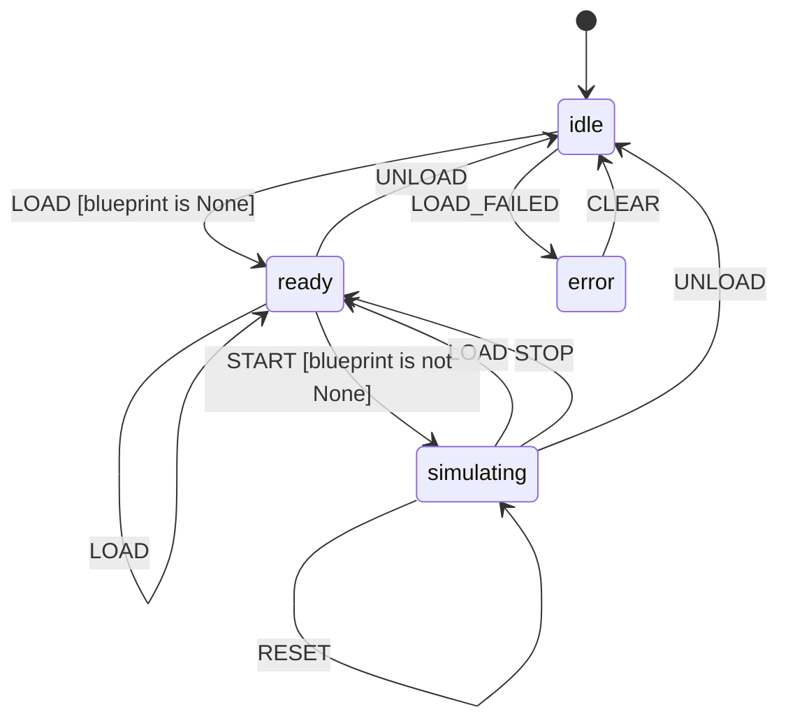

# L++ Event Sequence Simulator

Interactive simulation of L++ blueprints for what-if analysis and state space exploration.

## Overview

The Event Sequence Simulator allows you to load any L++ blueprint and interactively explore its behavior by:

- Dispatching events manually
- Running pre-defined event sequences
- Fuzzing with random events
- Exploring the full state space
- Finding paths to target states
- Creating forks for what-if analysis
- Exporting and replaying traces

## State Machine


> **Interactive View:** [Open zoomable diagram](results/event_simulator_diagram.html) for pan/zoom controls


## Installation

The simulator is part of the L++ utils. No additional installation required.

## Usage

### Interactive CLI

```bash
python interactive.py [blueprint_path]
```

### Commands

| Command | Description |
|---------|-------------|
| `load <path>` | Load a blueprint for simulation |
| `start` | Start simulation (init state) |
| `dispatch <event>` | Dispatch an event |
| `set <key> <value>` | Set context value |
| `back` | Step back to previous state |
| `fork [name]` | Create a fork of current state |
| `switch <name>` | Switch to a named fork |
| `seq <e1,e2,...>` | Set event sequence |
| `run` | Run the event sequence |
| `fuzz [n]` | Random walk for n steps |
| `path <state>` | Find path to target state |
| `explore [depth]` | Explore state space (BFS) |
| `trace` | Show execution trace |
| `space` | Show explored state space |
| `events` | Show available events |
| `gates` | Evaluate all gates |
| `export [path]` | Export trace to JSON |
| `import <path>` | Import trace for replay |
| `reset` | Reset to initial state |
| `stop` | Stop simulation |
| `unload` | Unload blueprint |
| `help` | Show help |
| `quit` | Exit simulator |

### Examples

#### Manual Simulation

```
> load ../visualizer/visualizer.json
> start
> LOAD
> VIEW
> trace
```

#### Path Finding

```
> load ../visualizer/visualizer.json
> start
> path viewing
Path to 'viewing' found!
Events: LOAD -> VIEW
```

#### Fuzzing

```
> load ../visualizer/visualizer.json
> start
> fuzz 10
Fuzz Run (10 steps requested):
Step 1: idle --[LOAD]--> loaded
Step 2: loaded --[VIEW]--> viewing
...
```

#### What-If Analysis

```
> load my_blueprint.json
> start
> DISPATCH event1
> fork branch1
> DISPATCH event2
> switch main
> DISPATCH event3
> switch branch1
```

## Compute Functions

| Function | Description |
|----------|-------------|
| `load_blueprint` | Load blueprint for simulation |
| `init_simulation` | Initialize simulation state |
| `set_context` | Set context values |
| `dispatch_event` | Dispatch event and process transition |
| `evaluate_gates` | Evaluate gates with simulated context |
| `get_available_events` | List valid events in current state |
| `fork_simulation` | Create fork for what-if analysis |
| `switch_fork` | Switch to a different fork |
| `step_back` | Step back to previous state (from trace) |
| `run_sequence` | Execute event sequence |
| `fuzz_run` | Random event exploration |
| `find_path` | Find path to target state |
| `explore_state_space` | Enumerate reachable states |
| `export_trace` | Export simulation trace |
| `import_trace` | Import and replay trace |
| `reset_simulation` | Reset to initial state |

## Context Schema

| Property | Type | Description |
|----------|------|-------------|
| `blueprint` | object | The loaded blueprint object |
| `blueprint_path` | string | Path to the loaded blueprint |
| `blueprint_name` | string | Blueprint name |
| `sim_state` | string | Current simulated state |
| `sim_context` | object | Simulated context values |
| `available_events` | array | Events available in current state |
| `trace` | array | Execution trace history |
| `forks` | object | Named simulation forks |
| `current_fork` | string | Name of current fork |
| `state_space` | object | Explored state space graph |
| `path_result` | object | Result of path finding |
| `fuzz_result` | object | Fuzzing run result |
| `sequence` | array | Event sequence to execute |
| `mode` | string | Simulation mode |

## File Structure

```
event_simulator/
  event_simulator.json   # L++ blueprint
  interactive.py         # CLI interface
  src/
    __init__.py          # Exports SIM_REGISTRY
    simulator_compute.py # Compute functions
  results/
    event_simulator_compiled.py  # Compiled operator
```

## License

Part of the L++ project.
