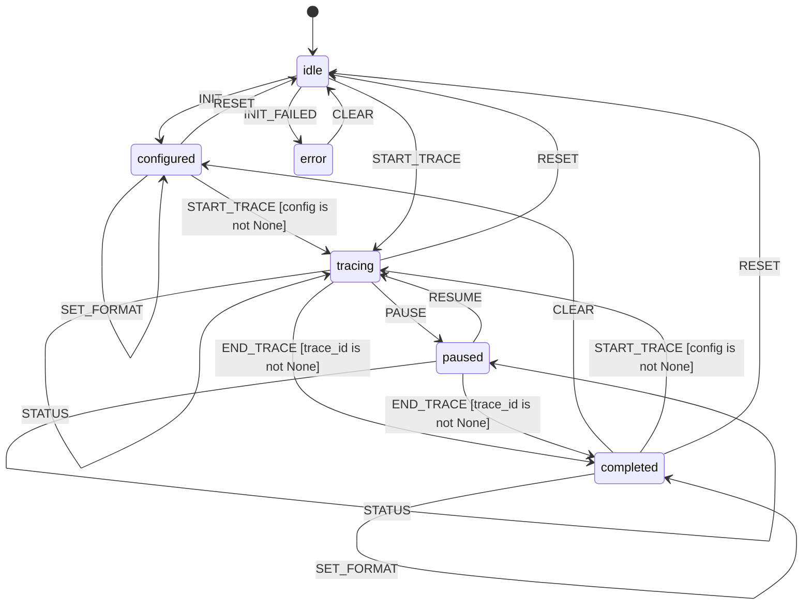

# L++ Execution Tracer

Structured logging and tracing for L++ blueprint execution with OpenTelemetry-compatible output formats.

## Overview

The Execution Tracer provides comprehensive tracing capabilities for L++ blueprint execution, including:

- **Trace Events**: Blueprint start/end, state transitions, gate evaluations, action executions, event dispatches, and context mutations
- **Span Hierarchy**: Parent-child span relationships for nested tracing
- **Multiple Output Formats**: OpenTelemetry JSON, JSON Lines, human-readable text, and ASCII timeline visualization
- **Trace Analysis**: Execution timeline, slowest operations, state visit frequency, and gate statistics

## State Machine


> **Interactive View:** [Open zoomable diagram](results/execution_tracer_diagram.html) for pan/zoom controls


## Usage

### Interactive CLI

```bash
cd utils/execution_tracer
python interactive.py
```

### Basic Workflow

```
# Initialize tracer
init human

# Start tracing a blueprint
start "My Workflow" my_workflow

# Record events
state idle processing START t_start
gate has_data pass "data is not None"
action process_data compute 45.5
ctx result None "{'success': true}"
state processing completed DONE t_done

# End trace
end

# View in different formats
human
timeline
otlp
jsonl

# Analyze trace
analyze

# Export
export trace_output.json
```

### Demo Mode

```
demo
```

Runs a complete demonstration trace showing all event types.

## Trace Event Types

| Event Type | Description | Span Created |
|------------|-------------|--------------|
| `STATE_CHANGE` | State transition | Yes (transition span) |
| `GATE_EVAL` | Gate evaluation with result | Yes (gate span) |
| `ACTION` | Action execution with timing | Yes (action span) |
| `EVENT` | Event dispatch | No (event only) |
| `CONTEXT_CHANGE` | Context mutation | No (event only) |
| `RECORD_SPAN` | Custom complete span | Yes |
| `START_SPAN` | Start timed span | Yes (open) |
| `END_SPAN` | End timed span | No (closes span) |

## Output Formats

### OpenTelemetry JSON (otlp)

Standard OTLP format compatible with OpenTelemetry collectors:

```json
{
  "resourceSpans": [{
    "resource": {
      "attributes": [
        {"key": "service.name", "value": {"stringValue": "lpp-execution-tracer"}},
        {"key": "lpp.blueprint.id", "value": {"stringValue": "workflow_id"}}
      ]
    },
    "scopeSpans": [{
      "scope": {"name": "lpp-tracer", "version": "1.0.0"},
      "spans": [...]
    }]
  }]
}
```

### JSON Lines (jsonl)

One JSON object per line for streaming and log aggregation:

```
{"type":"span","trace_id":"abc123","name":"transition:idle->active",...}
{"type":"event","trace_id":"abc123","event_type":"gate_eval",...}
```

### Human Readable (human)

Formatted text output for debugging:

```
======================================================================
  L++ Execution Trace: My Workflow
======================================================================
  Trace ID: abc123def456...
  Duration: 125.50ms
  Spans:    12
  Events:   8
======================================================================

SPANS:
----------------------------------------------------------------------
  [blueprint   ] blueprint:My Workflow                     125.50ms [OK]
  [transition  ] transition:idle->processing                 0.05ms [OK]
  [gate        ] gate:has_data                               0.01ms [OK]
  ...
```

### ASCII Timeline (timeline)

Visual timeline representation:

```
======================================================================
  Timeline: My Workflow
  Total Duration: 125.50ms
======================================================================

Span                           Timeline                                             ms
----------------------------------------------------------------------------------------------------
blueprint:My Workflow          |============================================================|  125.50
transition:idle->processing    |>..........................................................|    0.05
gate:has_data                  |?..........................................................|    0.01
action:process_data            |****.......................................................|   45.50
```

## Trace Analysis

The `analyze` command provides:

- **Total Duration**: End-to-end execution time
- **Spans by Type**: Count and total time per span type
- **Slowest Spans**: Top 5 longest-running spans
- **State Visits**: Frequency of state visits
- **Gate Statistics**: Pass/fail counts
- **Event Types**: Breakdown of event types

## Compute Functions

| Function | Description |
|----------|-------------|
| `init_tracer` | Initialize tracer with config |
| `start_trace` | Start a new trace |
| `end_trace` | End current trace |
| `record_span` | Record a complete span |
| `start_span` | Start a timed span |
| `end_span` | End a timed span |
| `record_state_change` | Record state transition |
| `record_gate_eval` | Record gate evaluation |
| `record_action` | Record action execution |
| `record_event` | Record event dispatch |
| `record_context_change` | Record context mutation |
| `format_otlp` | Format as OpenTelemetry |
| `format_jsonl` | Format as JSON Lines |
| `format_human` | Format as human readable |
| `format_timeline` | Format as ASCII timeline |
| `export_trace` | Export trace to file |
| `analyze_trace` | Analyze trace for insights |
| `render_status` | Render current status |
| `clear_trace` | Clear all trace data |

## Context Schema

| Property | Type | Description |
|----------|------|-------------|
| `config` | object | Tracer configuration |
| `trace_id` | string | Current trace UUID |
| `root_span_id` | string | Root span ID |
| `spans` | array | All recorded spans |
| `active_spans` | object | Currently open spans |
| `events` | array | Trace events |
| `blueprint_id` | string | Blueprint being traced |
| `blueprint_name` | string | Blueprint name |
| `start_time` | string | Trace start timestamp |
| `end_time` | string | Trace end timestamp |
| `output_format` | string | Current output format |
| `analysis_result` | object | Trace analysis results |
| `formatted_output` | string | Formatted trace output |

## Integration Example

```python
from utils.execution_tracer.src import TRACER_REGISTRY

# Create tracer operator
tracer = compile_and_load("execution_tracer.json", TRACER_REGISTRY)

# Initialize
tracer.dispatch("INIT", {"output_format": "human"})

# Start trace for your blueprint execution
tracer.dispatch("START_TRACE", {
    "blueprint_id": "my_workflow",
    "blueprint_name": "My Workflow"
})

# Record events during execution
tracer.dispatch("STATE_CHANGE", {
    "from_state": "idle",
    "to_state": "active",
    "transition_id": "t_start",
    "trigger_event": "START"
})

# End and export
tracer.dispatch("END_TRACE")
tracer.dispatch("FORMAT_HUMAN")
tracer.dispatch("EXPORT", {"path": "trace.txt"})
```

## Files

- `execution_tracer.json` - L++ blueprint definition
- `src/__init__.py` - Package exports (TRACER_REGISTRY)
- `src/tracer_compute.py` - Compute functions
- `interactive.py` - CLI interface
- `results/` - Compiled output and exports
