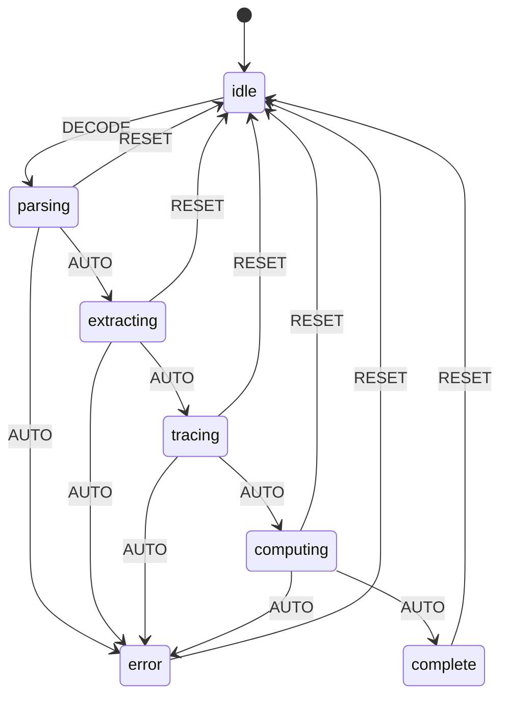

# Function Decoder

**L++ Skill** for analyzing Python scripts to extract inbound/outbound function interfaces and build modular dependency graphs.

## Purpose

While `logic_decoder` focuses on **control flow** (states/transitions), `function_decoder` focuses on **modularity** (dependencies/interfaces):

- **Inbound Interface**: Public functions/classes that this module exports
- **Outbound Dependencies**: External calls grouped by source (stdlib, pip, local)
- **Internal Call Graph**: How internal functions call each other
- **Coupling Metrics**: Fan-in, fan-out, instability index

## Usage

```bash
cd utils/function_decoder
python interactive.py
```

### Commands

| Command | Description |
|---------|-------------|
| `decode <file.py>` | Analyze a Python file |
| `show` | Display full module graph JSON |
| `graph` | Print ASCII summary of inbound/outbound |
| `export [file]` | Export module graph to JSON |
| `reset` | Clear analysis state |
| `quit` | Exit |

### Example

```
[idle]> decode ../logic_decoder/src/decoder_compute.py
Exports: 19 | Imports: 4
Internal edges: 44

[complete]> graph

=== decoder_compute ===

INBOUND (exports):
  function     hasValue(params) -> dict
  function     loadFile(params) -> dict
  function     parseAst(params) -> dict
  ...

OUTBOUND (imports):
  [stdlib] ast: *
  [stdlib] json: *
  [stdlib] os: *
  [stdlib] typing: Any

Coupling: fanIn=19 fanOut=4 instability=0.174
```

## Output Schema

The `moduleGraph` output contains:

```json
{
  "module": "decoder_compute",
  "filePath": "/path/to/file.py",
  "inbound": [
    {"type": "function", "name": "foo", "args": ["x"], "returns": "dict"}
  ],
  "outbound": [
    {"module": "json", "category": "stdlib", "names": []}
  ],
  "nodes": [...],
  "edges": [...],
  "coupling": {
    "fanIn": 19,
    "fanOut": 4,
    "instability": 0.174,
    "internalEdges": 44
  }
}
```

## Coupling Metrics

| Metric | Formula | Interpretation |
|--------|---------|----------------|
| **Fan-In** | # of exports | How many things depend on this |
| **Fan-Out** | # of imports | How many things this depends on |
| **Instability** | Ce/(Ca+Ce) | 0 = stable, 1 = unstable |

## Cross-Script Linking

Export module graphs from multiple scripts and link them by matching:
- Script A's `outbound.localCalls` → Script B's `inbound`

This creates a project-wide function dependency graph.

## State Machine



## Files

| File | Purpose |
|------|---------|
| `function_decoder.json` | L++ Blueprint |
| `src/function_decoder_compute.py` | Compute units |
| `interactive.py` | CLI wrapper |
| `tla/function_decoder.tla` | TLA+ specification |

## State Machine Visualization

Interactive state machine diagram: [function_decoder_graph.html](results/function_decoder_graph.html)

Open the HTML file in a browser for:
- Zoom/pan navigation
- Click nodes to highlight connections
- Hover for gate conditions
- Multiple layout options (hierarchical, horizontal, circular, grid)
