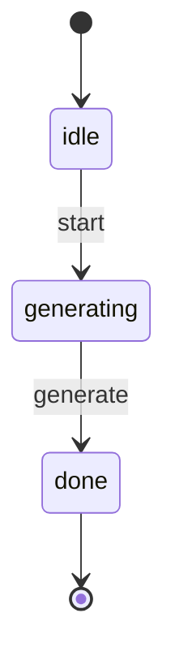

# Graph Visualizer

Interactive HTML/SVG state machine visualization for L++ blueprints.

## Features

- **Multiple Layout Modes**:
  - **Hierarchical** (default) - Top-to-bottom flow by layer depth
  - **Horizontal** - Left-to-right flow
  - **Circular** - States arranged in a circle
  - **Grid** - States in a grid pattern
- **Draggable nodes** - Click and drag to reposition any node
- **Zoom & Pan** - Mouse wheel to zoom, drag canvas to pan  
- **Click to highlight** - Click nodes to show incoming/outgoing transitions
- **Upstream tracing** - Toggle "Show Upstream" to trace all paths leading to a state
- **Gate conditions** - Hover on edges to see event names and gate conditions
- **Color-coded states**:
  - Cyan: Entry state
  - Red: Terminal state
  - Orange: Error state
  - Purple: Normal state

## Usage

```bash
cd utils/graph_visualizer
python interactive.py <blueprint.json>
open output.html
```

Example:
```bash
python interactive.py ../skill_contractor/skill_contractor.json
# Creates output.html - open in browser
```

## State Machine



## Generated by Skill Contractor

This skill was generated by the `skill_contractor` autonomous L++ skill generator.

## State Machine Visualization

Interactive state machine diagram: [graph_visualizer_graph.html](results/graph_visualizer_graph.html)

Open the HTML file in a browser for:
- Zoom/pan navigation
- Click nodes to highlight connections
- Hover for gate conditions
- Multiple layout options (hierarchical, horizontal, circular, grid)
