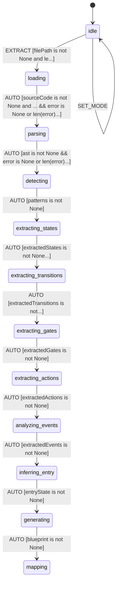

# Legacy Code State Machine Extractor

Extract state machine patterns from legacy Python code and convert to L++ blueprints.

**Version:** 1.0.0
**ID:** `legacy_extractor`

## Overview

The Legacy Extractor analyzes Python source code to identify state machine patterns and generates corresponding L++ blueprints. It supports multiple analysis modes and provides confidence scores for extracted elements.

## State Machine


> **Interactive View:** [Open zoomable diagram](results/legacy_extractor_diagram.html) for pan/zoom controls


## Features

### Pattern Detection

The extractor detects the following state machine patterns:

1. **State Classes**: Classes with `state`, `status`, or similar attributes
2. **Enum Definitions**: Enums that define state values
3. **If-Elif Chains**: Conditional chains checking state variables
4. **Match Statements**: Python 3.10+ match/case on state
5. **Event Handlers**: Methods with prefixes like `on_`, `handle_`, `do_`
6. **Constants**: Uppercase constants that may represent states

### Analysis Modes

| Mode | Description |
|------|-------------|
| `heuristic` | Pattern-based detection (default) |
| `annotated` | Look for special comments/decorators |
| `log` | Infer states from execution logs |
| `hybrid` | Combine multiple approaches |

### Confidence Scoring

Each extracted element includes a confidence score:

- **1.0**: From explicit annotations or enums
- **0.85-0.95**: From class definitions or clear patterns
- **0.7-0.85**: From if-chains or constants
- **<0.7**: Uncertain, requires human review

## Usage

### Interactive CLI

```bash
cd utils/legacy_extractor
python interactive.py
```

Commands:
- `mode <mode>` - Set analysis mode (heuristic, annotated, log, hybrid)
- `extract <file.py>` - Extract state machine from file
- `show` - Display generated blueprint
- `export <path>` - Export blueprint to JSON file
- `report <path>` - Export extraction report
- `reset` - Reset extractor state
- `quit` - Exit

### Example Session

```
[idle]> mode heuristic
Mode set to: heuristic
[idle]> extract tests/sample_state_machine.py
Extracted: 10 states, 20 transitions
[complete]> show
{
  "$schema": "lpp/v0.1.2",
  "id": "extracted_sample_state_machine",
  ...
}
[complete]> export extracted_order_machine.json
Exported to: extracted_order_machine.json
```

## Compute Functions

| Function | Description |
|----------|-------------|
| `loadSource` | Load Python source file from disk |
| `parseAst` | Parse source code into AST |
| `findStatePatterns` | Detect state machine patterns |
| `extractStates` | Extract state definitions |
| `extractTransitions` | Extract state transitions |
| `extractGates` | Extract gate conditions |
| `extractActions` | Extract actions from side effects |
| `analyzeEventHandlers` | Find event handling patterns |
| `inferEntryState` | Infer entry and terminal states |
| `generateBlueprint` | Generate L++ blueprint |
| `generateMapping` | Generate source->blueprint mapping |
| `exportBlueprint` | Export blueprint to file |
| `exportReport` | Export extraction report |

## Gates

| Gate | Expression |
|------|------------|
| `hasFilePath` | `filePath is not None and len(filePath) > 0` |
| `hasSourceCode` | `sourceCode is not None and len(sourceCode) > 0` |
| `hasAst` | `ast is not None` |
| `hasPatterns` | `patterns is not None` |
| `hasStates` | `extractedStates is not None and len(extractedStates) > 0` |
| `hasTransitions` | `extractedTransitions is not None` |
| `hasGates` | `extractedGates is not None` |
| `hasActions` | `extractedActions is not None` |
| `hasEvents` | `extractedEvents is not None` |
| `hasEntryState` | `entryState is not None` |
| `hasBlueprint` | `blueprint is not None` |
| `hasMapping` | `sourceMapping is not None` |
| `hasError` | `error is not None and len(error) > 0` |
| `noError` | `error is None or len(error) == 0` |

## Output Format

### Generated Blueprint

The extractor produces a standard L++ blueprint with:
- States extracted from code patterns
- Transitions derived from method logic
- Gates from conditional expressions
- Actions from side effects
- Entry/terminal states inferred automatically

### Source Mapping

The mapping output links each blueprint element to its source location:

```json
{
  "source": "path/to/file.py",
  "blueprint_id": "extracted_file",
  "elements": [
    {
      "type": "state",
      "source_location": "path/to/file.py:42",
      "blueprint_element": "states.pending",
      "confidence": 0.95
    }
  ]
}
```

### Extraction Report

```json
{
  "source_file": "path/to/file.py",
  "extraction_summary": {
    "states_extracted": 10,
    "transitions_extracted": 20,
    "gates_extracted": 14,
    "actions_extracted": 8
  },
  "confidence_summary": {
    "high_confidence": 15,
    "medium_confidence": 10,
    "low_confidence": 2
  }
}
```

## Test Files

Sample files for testing extraction:

- `tests/sample_state_machine.py` - Various state machine patterns
- `tests/sample_event_handlers.py` - Event-driven patterns

---

*Generated by L++ Legacy Extractor v1.0.0*
