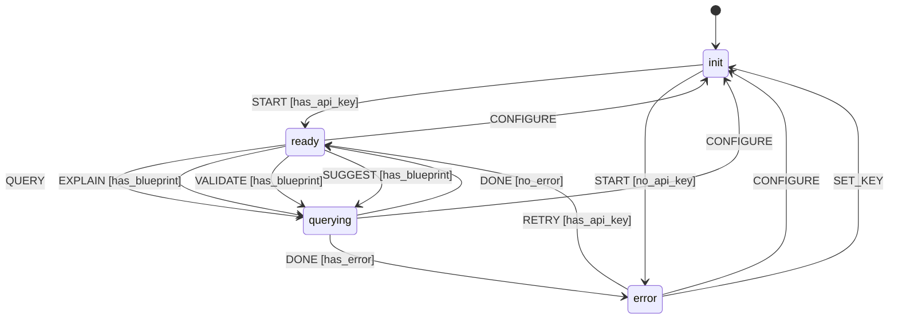

# L++ LLM Schema Assistant

LLM-powered automation building block for understanding and working with L++ blueprints via OpenAI v1-compatible API.

## Architecture (per build_rules.md)

```
llm_assistant/
├── llm_assistant.json      # The Bone: State machine blueprint
├── interactive.py          # The Extrusion: Minimal wrapper (<50 lines)
├── README.md               # The Documentation
├── src/
│   ├── __init__.py         # Registry exports
│   ├── llm_compute.py      # The Flesh: Hermetic COMPUTE units
│   └── llm_cli.py          # CLI logic (separated from extrusion)
└── results/                # Compiled operators (generated)
```

## Flange Spec (context_schema)

```json
{
  "api_key": "string",       // OpenAI-compatible API key
  "api_base": "string",      // API endpoint URL
  "model": "string",         // Model identifier
  "schema_content": "string", // Loaded L++ schema
  "blueprint": "object",     // Currently loaded blueprint
  "conversation": "array",   // [{role, content}] history
  "last_response": "string", // LLM output
  "temperature": "number",   // 0.0-2.0
  "max_tokens": "number"     // Response limit
}
```

## COMPUTE Registry

| Unit | Description |
|------|-------------|
| `llm:init_config` | Load config from environment |
| `llm:load_schema` | Load L++ schema specification |
| `llm:load_blueprint` | Load blueprint from file |
| `llm:query` | Send contextual query to LLM |
| `llm:explain_blueprint` | Get blueprint explanation |
| `llm:validate_blueprint` | Validate against schema |
| `llm:suggest_improvements` | Get improvement suggestions |
| `llm:generate_blueprint` | Generate blueprint from description |

## Usage

### Environment Setup

```bash
export OPENAI_API_KEY="your-key"
export OPENAI_API_BASE="https://api.openai.com/v1"  # or compatible endpoint
export LPP_LLM_MODEL="gpt-4o-mini"
```

### Interactive Mode

```bash
cd utils/llm_assistant
python interactive.py
```

### Commands

| Command | Description |
|---------|-------------|
| `help` | Show commands |
| `status` | Show configuration |
| `key <key>` | Set API key |
| `model <name>` | Set model |
| `load <path>` | Load blueprint |
| `explain` | Explain loaded blueprint |
| `validate` | Validate against schema |
| `suggest` | Get improvements |
| `generate <desc>` | Generate new blueprint |
| `ask <question>` | Freeform query |

### Programmatic Usage (Agent Building Block)

```python
from src.llm_compute import query, load_blueprint, load_schema

# Load context
schema = load_schema({})
bp = load_blueprint({"path": "my_blueprint.json"})

# Query with full context
result = query({
    "api_key": os.environ["OPENAI_API_KEY"],
    "api_base": "https://api.openai.com/v1",
    "model": "gpt-4o-mini",
    "schema_content": schema["schema_content"],
    "blueprint": bp["blueprint"],
    "conversation": [],
    "query": "What states can transition to 'approved'?"
})

print(result["response"])
```

## Compatible APIs

Uses OpenAI v1 API format, compatible with:
- OpenAI
- Azure OpenAI
- Ollama (`http://localhost:11434/v1`)
- LM Studio
- Any OpenAI-compatible endpoint

## State Machine



## Logic Graph (Auto-decoded from Python)

This visualization was auto-generated by analyzing the Python compute module.

**View:** [Open llm_assistant_logic_graph.html](results/llm_assistant_logic_graph.html)

| Metric | Value |
|--------|-------|
| States | 0 |
| Transitions | 0 |
| Entry | `idle` |
| Terminal | ['complete', 'error'] |

## State Machine Visualization

Interactive state machine diagram: [llm_assistant_graph.html](results/llm_assistant_graph.html)

Open the HTML file in a browser for:
- Zoom/pan navigation
- Click nodes to highlight connections
- Hover for gate conditions
- Multiple layout options (hierarchical, horizontal, circular, grid)
