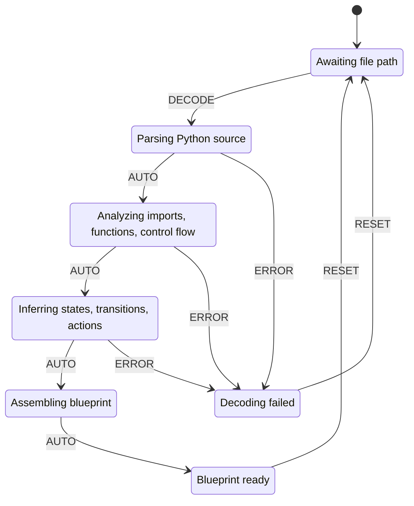

# Logic Decoder

**L++ Skill** | Version 1.0.0 | TLA+ Verified ✓

Python→L++ blueprint reverse engineering tool. Analyzes Python source files using AST parsing,
import semantics, and control flow analysis to generate L++ blueprints.

## Features

- **AST Analysis**: Parses Python source into abstract syntax tree
- **Import Semantics**: Maps packages to semantic categories (http, database, filesystem, etc.)
- **Function Extraction**: Identifies functions, classes, and their side effects
- **Control Flow**: Detects branches, loops, error handling patterns
- **State Inference**: Converts code patterns into L++ states
- **Transition Generation**: Creates state transitions from control flow

## State Machine



## Usage

```bash
cd utils/logic_decoder
python interactive.py
```

**Commands:**
- `decode <file.py>` - Analyze Python file and generate blueprint
- `show` - Display generated blueprint as JSON
- `export [file]` - Save blueprint to file (default: decoded_blueprint.json)
- `reset` - Clear current analysis
- `quit` - Exit

## Example

```
LogicDecoder: decode <file.py> | show | export [file] | reset | quit
[idle]> decode ../scholar_chat/src/scholar_compute.py
Decoded: 6 states, 10 transitions
Imports: ['meta', 'unknown', 'serialization', 'http', 'filesystem', 'system']
[complete]> show
{
  "$schema": "lpp/v0.1",
  "id": "decoded_scholar_compute",
  "name": "Decoded: scholar_compute",
  ...
}
[complete]> export my_blueprint.json
Exported to: my_blueprint.json
```

## Import Semantic Mapping

| Package | Category | Implied Actions |
|---------|----------|-----------------|
| requests, urllib | http | fetch |
| pandas, numpy | dataframe | transform, aggregate |
| sqlite3, sqlalchemy | database | query, persist |
| os, pathlib | filesystem | readFile, writeFile |
| json, yaml | serialization | parse, dump |
| asyncio | async | parallel, await |
| logging | observability | log, trace |

## Flanges

| Type | Fields |
|------|--------|
| **Inputs** | filePath, sourceCode |
| **Outputs** | blueprint, blueprintJson, analysisReport |
| **Stacks** | code_parser, ast_analyzer |

## Validation

```
TLA+ Model Check: PASS
States: 23
Distinct: 16
Depth: 6
```

## Files

```
utils/logic_decoder/
├── logic_decoder.json     # Blueprint definition
├── interactive.py         # CLI wrapper (<50 lines)
├── README.md              # This file
├── src/
│   └── decoder_compute.py # Compute units
├── results/
│   └── logic_decoder_compiled.py
└── tla/
    ├── logic_decoder.tla
    └── logic_decoder.cfg
```

## Compute Units

| Unit | Description |
|------|-------------|
| decoder:loadFile | Load Python file from disk |
| decoder:parseAst | Parse source into AST |
| decoder:analyzeImports | Extract import semantics |
| decoder:analyzeFunctions | Extract function/class definitions |
| decoder:analyzeControlFlow | Build control flow graph |
| decoder:inferStates | Infer L++ states from patterns |
| decoder:inferTransitions | Infer transitions and guards |
| decoder:inferActions | Infer actions from side effects |
| decoder:generateBlueprint | Assemble final blueprint |
| decoder:hasValue | Gate: check if context field has value |
| decoder:clearState | Reset all analysis state |

## Build

```bash
./utils/build_skill.sh utils/logic_decoder --validate  # Compile + TLA+ check
./utils/build_skill.sh utils/logic_decoder --mermaid   # + Generate Mermaid
```

## State Machine Visualization

Interactive state machine diagram: [logic_decoder_graph.html](results/logic_decoder_graph.html)

Open the HTML file in a browser for:
- Zoom/pan navigation
- Click nodes to highlight connections
- Hover for gate conditions
- Multiple layout options (hierarchical, horizontal, circular, grid)

## Logic Graph (Auto-decoded from Python)

This visualization was auto-generated by analyzing the Python compute module.

**View:** [Open logic_decoder_logic_graph.html](results/logic_decoder_logic_graph.html)

| Metric | Value |
|--------|-------|
| States | 0 |
| Transitions | 0 |
| Entry | `idle` |
| Terminal | ['complete', 'error'] |
