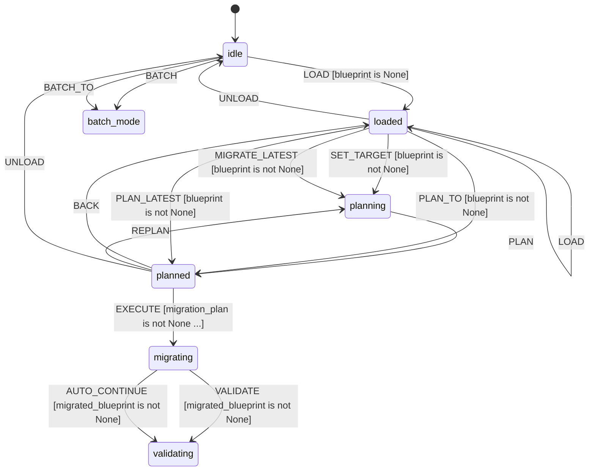

# L++ Schema Migrator

A deterministic tool for migrating L++ blueprints between schema versions.

## Overview

The Schema Migrator provides automated migration of L++ blueprints when the schema evolves. It detects the current schema version, plans a migration path, and applies transformations to update blueprints to newer schema versions.

## Features

- **Version Detection**: Automatically detect schema version from blueprint structure
- **Migration Planning**: Find optimal path from source to target version
- **Dry Run Mode**: Preview changes without applying them
- **Validation**: Validate migrated blueprints against target schema
- **Batch Migration**: Migrate multiple blueprints at once
- **Custom Migrations**: Define custom migration rules in JSON

## State Machine


> **Interactive View:** [Open zoomable diagram](results/schema_migrator_diagram.html) for pan/zoom controls


## Quick Start

### Command Line

```bash
# Preview migration
python interactive.py path/to/blueprint.json --preview

# Apply migration
python interactive.py path/to/blueprint.json --migrate
```

### Interactive Mode

```bash
python interactive.py

> load path/to/blueprint.json
> detect                    # Show detected version
> plan 0.1.2               # Plan migration to v0.1.2
> preview                   # Dry run
> migrate                   # Apply migration
> export migrated.json     # Export result
```

### Programmatic Usage

```python
from src.migrator_compute import (
    load_blueprint,
    detect_version,
    list_migrations,
    plan_migration,
    apply_migration,
    validate_blueprint,
)

# Load blueprint
result = load_blueprint({"path": "my_blueprint.json"})
blueprint = result["blueprint"]

# Detect version
version = detect_version({"blueprint": blueprint})["source_version"]
print(f"Current version: {version}")

# Plan migration
migrations = list_migrations({})["migrations"]
plan = plan_migration({
    "source_version": version,
    "target_version": "lpp/v0.1.2",
    "available_migrations": migrations
})["plan"]

# Apply migration
migrated = apply_migration({
    "blueprint": blueprint,
    "migration_plan": plan
})["blueprint"]

# Validate
valid = validate_blueprint({
    "blueprint": migrated,
    "target_version": "lpp/v0.1.2"
})["result"]["valid"]
```

## Supported Migrations

### Built-in Migrations

| From | To | Description |
|------|-----|-------------|
| `lpp/v0.1.0` | `lpp/v0.1.1` | Standardize `on_event` and `context_schema` |
| `lpp/v0.1.1` | `lpp/v0.1.2` | Trinity Refinement: `guard` to `gates`, add `display` |

### Migration Changes

#### v0.1.0 to v0.1.1
- Rename `event` to `on_event` in transitions
- Rename `context` to `context_schema`
- Ensure `context_schema.properties` exists

#### v0.1.1 to v0.1.2
- Rename `guard` to `gates` (wrapped as array)
- Add `display` field with empty rules
- Convert `terminal_states` from string to array
- Remove deprecated `fork_join_patterns`

## Custom Migrations

Create JSON migration files in the `migrations/` directory:

```json
{
  "from_version": "lpp/v0.1.2",
  "to_version": "lpp/v0.2.0",
  "description": "My custom migration",
  "changes": [
    {
      "type": "add_field",
      "path": "",
      "field": "new_field",
      "default": {}
    }
  ]
}
```

See `migrations/README.md` for full documentation on change types.

## Commands

| Command | Description |
|---------|-------------|
| `load <path>` | Load a blueprint for migration |
| `self` | Load the schema migrator itself |
| `detect` | Show detected schema version |
| `list` | List available migrations |
| `plan [version]` | Plan migration (to version or latest) |
| `preview` | Dry run - show changes without applying |
| `migrate` | Apply migration |
| `validate` | Validate migrated blueprint |
| `export <path>` | Export migrated blueprint to file |
| `report` | Show migration report |
| `changes` | Show planned changes |
| `diff` | Show diff between original and migrated |
| `batch <paths>` | Batch migrate multiple blueprints |
| `back` | Go back to previous state |
| `unload` | Unload current blueprint |
| `clear` | Clear error state |
| `quit` | Exit |

## File Structure

```
schema_migrator/
    schema_migrator.json    # L++ blueprint
    interactive.py          # CLI interface
    README.md               # This file
    src/
        __init__.py         # Exports MIGRATE_REGISTRY
        migrator_compute.py # Compute functions
    migrations/
        README.md           # Migration format documentation
        v0.1.0_to_v0.1.1.json
        v0.1.1_to_v0.1.2.json
    tests/
        test_migration.py   # Unit tests
    results/
        schema_migrator_compiled.py
```

## Testing

```bash
# Run unit tests
python -m utils.schema_migrator.tests.test_migration

# Or directly
python utils/schema_migrator/tests/test_migration.py
```

## Context Schema

| Property | Type | Description |
|----------|------|-------------|
| `blueprint` | object | The loaded blueprint to migrate |
| `blueprint_path` | string | Path to the blueprint file |
| `source_version` | string | Detected source schema version |
| `target_version` | string | Target schema version for migration |
| `available_migrations` | array | List of available migration definitions |
| `migration_plan` | array | Ordered list of migrations to apply |
| `migration_changes` | array | Detailed list of changes to be made |
| `migrated_blueprint` | object | The blueprint after migration |
| `validation_result` | object | Validation result against target schema |
| `report` | string | Generated migration report |
| `error` | string | Error message if any |
| `dry_run_mode` | boolean | If true, preview changes without applying |
| `batch_paths` | array | Paths for batch migration |
| `batch_results` | array | Results of batch migration |

## Compute Functions

| Function | Description |
|----------|-------------|
| `load_blueprint` | Load blueprint from file |
| `detect_version` | Detect current schema version |
| `get_latest_version` | Get latest supported schema version |
| `list_migrations` | List all available migrations |
| `plan_migration` | Plan migration path |
| `analyze_changes` | Analyze what changes will be made |
| `apply_migration` | Apply the migration plan |
| `validate_blueprint` | Validate against target schema |
| `generate_report` | Generate migration report |
| `export_migrated` | Export migrated blueprint |
| `dry_run` | Preview changes without applying |
| `batch_migrate` | Migrate multiple blueprints |
| `clear_migration` | Clear migration state |
| `unload_blueprint` | Unload all blueprint state |
