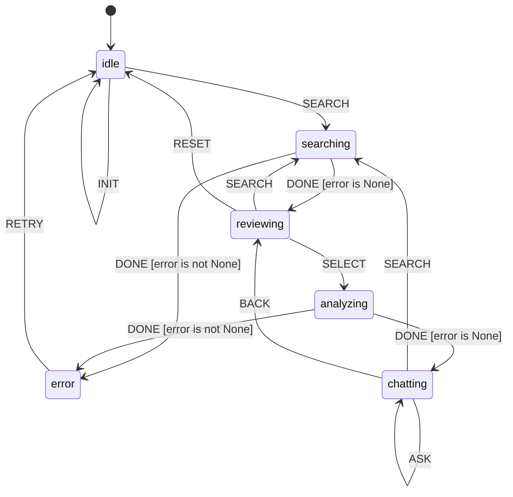

# Scholar Chatbot

LLM-powered research assistant with deep search capabilities. Stacks `research_scraper` and `llm_assistant` flanges for Logic Stacking.

## State Machine


> **Interactive View:** [Open zoomable diagram](results/scholar_chat_diagram.html) for pan/zoom controls


## Workflow

1. **SEARCH**: Query arXiv and Semantic Scholar
2. **SELECT**: Choose papers for deep analysis (e.g., `0,1,2`)
3. **SYNTHESIZE**: LLM generates research synthesis with citations
4. **ASK**: Continue Q&A conversation about the research

## Usage

```bash
export OPENAI_API_KEY="your-key"
export OPENAI_API_BASE="https://api.openai.com/v1"  # or self-hosted
export OPENAI_MODEL="gpt-4"

cd utils/scholar_chat
python interactive.py
```

Commands:
- `search <query>` - Search academic sources
- `select <0,1,2>` - Select papers by index for analysis
- `ask <question>` - Ask follow-up questions
- `back` - Return to paper selection
- `reset` - Start over
- `quit` - Exit

## Example Session

```
[idle]> search transformer attention mechanism
  [0] Attention Is All You Need (arxiv)
  [1] BERT: Pre-training of Deep Bidirectional... (arxiv)
  [2] Vision Transformer (arxiv)
  ...

[reviewing]> select 0,1,2
  [LLM synthesizing 3 papers...]
  
  The transformer architecture introduced in [1] revolutionized...
  
  Q: How do vision transformers differ from text transformers?
  Q: What are the computational trade-offs of self-attention?

[chatting]> ask How does positional encoding work?
  Positional encoding in transformers...
```

## Logic Stacking

This skill stacks flanges from existing skills:

| Flange Source | Fields Used |
|---------------|-------------|
| `research_scraper` | query, sources, searchResults, paperDetails |
| `llm_assistant` | apiKey, apiBase, model, conversation |

## Build

```bash
../../utils/build_skill.sh scholar_chat --validate --mermaid
```

## TLA+ Validation

- States: 77
- Distinct: 41
- Depth: 6
- Result: PASS

## Logic Graph (Auto-decoded from Python)

This visualization was auto-generated by analyzing the Python compute module.

**View:** [Open scholar_chat_logic_graph.html](results/scholar_chat_logic_graph.html)

| Metric | Value |
|--------|-------|
| States | 0 |
| Transitions | 0 |
| Entry | `idle` |
| Terminal | ['complete', 'error'] |

## State Machine Visualization

Interactive state machine diagram: [scholar_chat_graph.html](results/scholar_chat_graph.html)

Open the HTML file in a browser for:
- Zoom/pan navigation
- Click nodes to highlight connections
- Hover for gate conditions
- Multiple layout options (hierarchical, horizontal, circular, grid)
