# Skill Contractor v1.7.0

An autonomous L++ skill generator that continuously iterates on logic to achieve coding targets with self-evaluation.
**Two-phase workflow**: Blueprint validation before implementation.

## Overview

The Skill Contractor implements the manifesto:
> "Create an AI agent that would continuously iterate on the logic and achieve coding target when self evaluation see fit."

It operates as an autonomous loop with **two distinct phases**:

### Phase 1: Blueprint
1. **Plan** - Generate L++ blueprint JSON
2. **Validate** - Run `build_skill.sh --validate` (TLC model checking)
3. **Refine** - If validation fails, regenerate blueprint only
4. **Advance** - When validated, move to implementation phase

### Phase 2: Implementation
5. **Plan** - Generate compute + interactive steps
6. **Execute** - Write `src/<skill>_compute.py` and `interactive.py`
7. **Sanitize** - Auto-fix common LLM errors (literal newlines in strings)
8. **Validate** - Final validation (TLC + operational checks)
9. **Evaluate** - Self-assess progress against target

This two-phase approach prevents wasteful regeneration of already-validated blueprints.

### Code Sanitization

LLMs commonly generate Python with syntax errors like literal newlines inside strings:
```python
# LLM generates (BROKEN):
print("Hello
World")

# Sanitizer fixes to (VALID):
print("Hello\nWorld")
```

The `frame_py.operational_validator.sanitize_python_code()` function automatically fixes these errors before writing files to disk.

## State Machine

```mermaid
stateDiagram-v2
    %% L++ State Diagram: Skill Contractor
    [*] --> idle
    idle --> idle : START
    idle --> planning : SUBMIT [target is not None and len(...]
    planning --> executing : DONE [plan is not None && error is None]
    planning --> error : DONE [error is not None]
    executing --> parsing : DONE [raw_output is not None and ... && error is None]
    executing --> error : DONE [error is not None]
    parsing --> correcting : DONE [parsed_output is not None a... && corrections is not None and... && step_index + 1 < step_count]
    parsing --> stepping : DONE [parsed_output is not None a... && corrections is None or len(... && step_index + 1 < step_count]
    parsing --> correcting : DONE [parsed_output is not None a... && corrections is not None and... && step_index + 1 >= step_count && is_lpp_target == True && phase == "blueprint"]
    parsing --> validating : DONE [parsed_output is not None a... && corrections is None or len(... && step_index + 1 >= step_count && is_lpp_target == True && phase == "blueprint"]
    parsing --> correcting : DONE [parsed_output is not None a... && corrections is not None and... && step_index + 1 >= step_count && is_lpp_target == True && phase == "implementation"]
    parsing --> validating : DONE [parsed_output is not None a... && corrections is None or len(... && step_index + 1 >= step_count && is_lpp_target == True && phase == "implementation"]
    parsing --> correcting : DONE [parsed_output is not None a... && corrections is not None and... && step_index + 1 >= step_count && is_lpp_target != True]
    parsing --> evaluating : DONE [parsed_output is not None a... && corrections is None or len(... && step_index + 1 >= step_count && is_lpp_target != True]
    correcting --> stepping : DONE [corrections_approved == True && step_index + 1 < step_count]
    correcting --> validating : DONE [corrections_approved == True && step_index + 1 >= step_count && is_lpp_target == True && phase == "blueprint"]
    correcting --> validating : DONE [corrections_approved == True && step_index + 1 >= step_count && is_lpp_target == True && phase == "implementation"]
    correcting --> evaluating : DONE [corrections_approved == True && step_index + 1 >= step_count && is_lpp_target != True]
    parsing --> executing : DONE [parse_error is not None && (repair_attempts is None or...]
    parsing --> error : DONE [parse_error is not None && (repair_attempts is not Non...]
    stepping --> executing : DONE [step_index + 1 < step_count && error is None]
    stepping --> validating : DONE [step_index + 1 >= step_count && error is None && is_lpp_target == True && phase == "blueprint"]
    stepping --> validating : DONE [step_index + 1 >= step_count && error is None && is_lpp_target == True && phase == "implementation"]
    stepping --> evaluating : DONE [step_index + 1 >= step_count && error is None && is_lpp_target != True]
    stepping --> error : DONE [error is not None]
    validating --> planning : DONE [blueprint_validated is not ... && error is None && phase == "blueprint"]
    validating --> eval_interactive : DONE [lpp_validated is not None a... && error is None && phase == "implementation"]
    eval_interactive --> evaluating : DONE [interactive_valid is not No... && error is None]
    eval_interactive --> refining : DONE [interactive_valid is None o... && iteration < max_iterations]
    eval_interactive --> evaluating : DONE [interactive_valid is None o... && iteration >= max_iterations]
    eval_interactive --> error : DONE [error is not None]
    validating --> refining : DONE [blueprint_validated is None... && iteration < max_iterations && phase == "blueprint"]
    validating --> refining : DONE [is_lpp_target == True and (... && iteration < max_iterations && phase == "implementation"]
    validating --> evaluating : DONE [is_lpp_target == True and (... && iteration >= max_iterations]
    validating --> error : DONE [error is not None]
    evaluating --> complete : DONE [is_satisfied == True && is_lpp_target != True or lp... && error is None]
    evaluating --> refining : DONE [is_satisfied == True && is_lpp_target == True and (... && iteration < max_iterations && error is None]
    evaluating --> refining : DONE [is_satisfied == False or is... && iteration < max_iterations && error is None]
    evaluating --> complete : DONE [iteration >= max_iterations && is_lpp_target != True or lp...]
    evaluating --> error : DONE [iteration >= max_iterations && is_lpp_target == True and (...]
    evaluating --> error : DONE [error is not None]
    refining --> planning : DONE [error is None]
    refining --> error : DONE [error is not None]
    error --> executing : DONE [(step_error_count is None o... && plan is not None]
    error --> refining : DONE [plan is None or step_count ... && iteration < max_iterations]
    error --> complete : DONE [plan is None or step_count ... && iteration >= max_iterations]
    error --> reviewing : DONE [(step_error_count is not No...]
    error --> complete : DONE [iteration >= max_iterations && plan is not None]
    reviewing --> evaluating : DONE [failed_steps is not None an...]
    reviewing --> stepping : DONE [review_decision == "skip" && step_index + 1 < step_count]
    reviewing --> evaluating : DONE [review_decision == "skip" && step_index + 1 >= step_count]
    reviewing --> refining : DONE [review_decision == "replan" && iteration < max_iterations]
    reviewing --> evaluating : DONE [review_decision == "replan" && iteration >= max_iterations]
    reviewing --> stepping : DONE [review_decision is None or ... && step_index + 1 < step_count]
    reviewing --> evaluating : DONE [review_decision is None or ... && step_index + 1 >= step_count]
    reviewing --> refining : DONE [plan is None or step_count ... && iteration < max_iterations]
    reviewing --> complete : DONE [plan is None or step_count ... && iteration >= max_iterations]
    error --> idle : RETRY
    planning --> idle : RESET
    error --> idle : RESET
    executing --> idle : RESET
    complete --> idle : RESET
    refining --> idle : RESET
    reviewing --> idle : RESET
    parsing --> idle : RESET
    evaluating --> idle : RESET
    stepping --> idle : RESET
    correcting --> idle : RESET
    validating --> idle : RESET
    eval_interactive --> idle : RESET
    complete --> [*]
```


> **Interactive View:** [Open zoomable diagram](results/skill_contractor_diagram.html) for pan/zoom controls


## Context Schema (Flange)

| Property | Type | Description |
|----------|------|-------------|
| `target` | string | Coding target to achieve |
| `phase` | string | Current phase: "blueprint" or "implementation" |
| `blueprint_validated` | boolean | True if blueprint passed TLC validation |
| `plan` | object | Decomposed execution plan |
| `step_index` | number | Current step index |
| `step_count` | number | Total steps in plan |
| `execution_log` | array | History of executed steps |
| `artifacts` | array | Generated files |
| `score` | number | Evaluation score 0-100 |
| `threshold` | number | Score threshold for completion |
| `iteration` | number | Current iteration count |
| `max_iterations` | number | Max iterations allowed |
| `is_satisfied` | boolean | Target achieved flag |
| `is_lpp_target` | boolean | True if generating L++ skill |
| `lpp_validated` | boolean | Final L++ validation status |
| `parse_error` | string | Parse/validation error if any |
| `repair_attempts` | number | Number of output repair attempts |

## Events

| Event | Payload | Description |
|-------|---------|-------------|
| `START` | - | Initialize agent configuration |
| `SUBMIT` | `{target: string}` | Submit a coding target |
| `DONE` | - | Signal step/phase completion |
| `RETRY` | - | Recover from error state |
| `RESET` | - | Reset to idle (global) |

## Usage

```bash
# Set environment variables
export OPENAI_API_KEY="your-key"
export OPENAI_API_BASE="https://api.openai.com/v1"
export OPENAI_MODEL="gpt-4o-mini"
export EVAL_THRESHOLD="80"
export MAX_ITERATIONS="5"

# Run interactive CLI
cd always_on
python interactive.py
```

### Example Session

```
Always-On Agent v1.4.0 | State: idle | Phase: blueprint

> Create a skill that searches Google and generates opinions
  [PHASE: blueprint]
  [planning] Generating blueprint...
  [executing] Step 1: Create search_opinion.json...
  [parsing] Validating output...
  [validating] ./utils/build_skill.sh --validate...
  [BLUEPRINT VALIDATED] Advancing to implementation phase
  
  [PHASE: implementation]
  [planning] Generating implementation steps...
  [executing] Step 1: Create src/search_opinion_compute.py...
  [executing] Step 2: Create interactive.py...
  [validating] Final validation...
  [evaluating] Score 90/100 | Satisfied: True

Complete! Output in: always_on/output/
```

## Compute Units

| Unit | Description |
|------|-------------|
| `agent:init` | Initialize from environment, set phase="blueprint" |
| `agent:decompose` | Break target into steps (phase-aware) |
| `agent:generate_step_output` | Execute single step via LLM |
| `agent:parse_and_sanitize` | Parse and validate LLM output |
| `agent:write_output` | Write files to disk |
| `agent:advance_step` | Move to next step |
| `agent:advance_phase` | Move from blueprint to implementation |
| `agent:validate_lpp` | Run build_skill.sh validation |
| `agent:evaluate` | Self-evaluate progress |
| `agent:review_failed_step` | Decide skip or replan |

## Files

```
always_on/
  always_on.json        # Blueprint (The Bone)
  interactive.py        # CLI wrapper (Extrusion)
  manifesto.txt         # Original requirement
  README.md             # This file
  src/
    __init__.py
    always_on_compute.py   # Compute units (The Flesh)
    prompts.py             # Externalized prompts
  results/
    always_on_compiled.py  # Generated operator
  runs/
    <timestamp>/           # Per-run logs
      run.log
      step_0.log
      stdout.log
  tla/
    always_on.tla       # TLA+ specification
    always_on.cfg       # TLC configuration
  output/               # Generated skill output
```

## Design Notes

The agent follows the L++ Trinity:
- **Transitions**: Navigate between planning, executing, validating, evaluating states
- **Gates**: Guard conditions (blueprint_validated, lpp_valid, has_more_steps, etc.)
- **Actions**: SET context, COMPUTE via LLM, advance phase/step

### Two-Phase Workflow
- **Blueprint Phase**: Only generates/refines the `.json` blueprint until TLC passes
- **Implementation Phase**: Generates compute units and interactive wrapper without regenerating blueprint

### Error Recovery
- Step-level retry with max 3 attempts
- Parse error repair with re-prompting
- Review failed steps (skip or replan)

Self-evaluation uses a score threshold (default 80) to determine satisfaction.
If unsatisfied, the agent refines its plan using feedback and iterates.

## Logic Graph (Auto-decoded from Python)

This visualization was auto-generated by analyzing the Python compute module.

**View:** [Open skill_contractor_logic_graph.html](results/skill_contractor_logic_graph.html)

| Metric | Value |
|--------|-------|
| States | 0 |
| Transitions | 0 |
| Entry | `idle` |
| Terminal | ['complete', 'error'] |
