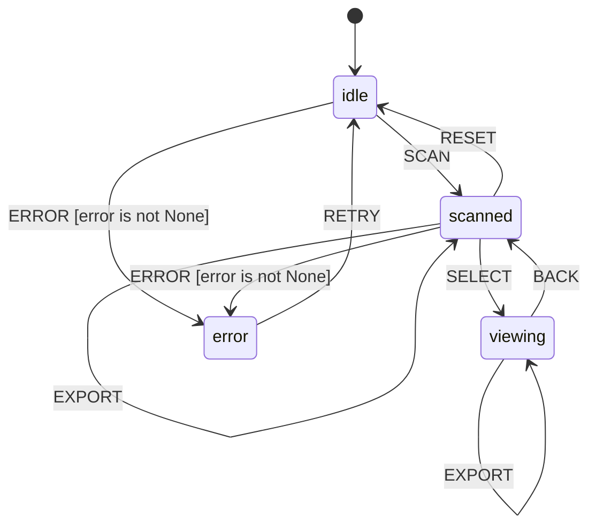

# Skill Registry

L++ skill for scanning and documenting all skills under `utils/` as context for agent blueprint generation.

## Purpose

Provides structured metadata about available L++ skills to help agents:
- Discover existing skill patterns
- Understand flange specifications (context schemas)
- Reference COMPUTE unit signatures
- Generate new blueprints following established patterns

## State Machine


> **Interactive View:** [Open zoomable diagram](results/skill_registry_diagram.html) for pan/zoom controls


## Usage

```bash
cd utils/skill_registry
python interactive.py
```

Commands:
- `scan [path]` - Scan directory for L++ skills (default: utils/)
- `list` - List discovered skills
- `view <id>` - View skill details (states, flange spec, compute units)
- `export` - Export full registry
- `context` - Output markdown context for agent
- `back` - Return to scanned state
- `quit` - Exit

## Example Session

```
[idle]> scan
  [lpp_visualizer] L++ Blueprint Visualizer v1.0.0 (5S/20T)
  [llm_schema_assistant] L++ LLM Schema Assistant v1.0.0 (4S/13T)
  [research_scraper] Research Scraper v1.0.1 (3S/9T)
  [skill_registry] Skill Registry v1.0.0 (4S/9T)

[scanned]> view llm_schema_assistant
  L++ LLM Schema Assistant: ['init', 'ready', 'querying', 'error']
  Flange: {'api_key': 'string', 'model': 'string', ...}

[viewing]> export
  Exported 4 skills

[scanned]> context
# L++ Skill Registry
Generated: 2025-12-30T00:00:36
Skills: 4
...
```

## Agent Context Output

The `context` command generates markdown with:
- Skill summaries (name, version, description)
- State lists and entry states
- Flange specs (context schema types)
- COMPUTE unit signatures (inputs -> outputs)
- Transition graphs

## Build

```bash
../../utils/build_skill.sh skill_registry --validate --mermaid
```

## TLA+ Validation

- States: 556
- Distinct: 176
- Depth: 6
- Result: PASS

## Logic Graph (Auto-decoded from Python)

This visualization was auto-generated by analyzing the Python compute module.

**View:** [Open skill_registry_logic_graph.html](results/skill_registry_logic_graph.html)

| Metric | Value |
|--------|-------|
| States | 0 |
| Transitions | 0 |
| Entry | `idle` |
| Terminal | ['complete', 'error'] |

## State Machine Visualization

Interactive state machine diagram: [skill_registry_graph.html](results/skill_registry_graph.html)

Open the HTML file in a browser for:
- Zoom/pan navigation
- Click nodes to highlight connections
- Hover for gate conditions
- Multiple layout options (hierarchical, horizontal, circular, grid)
