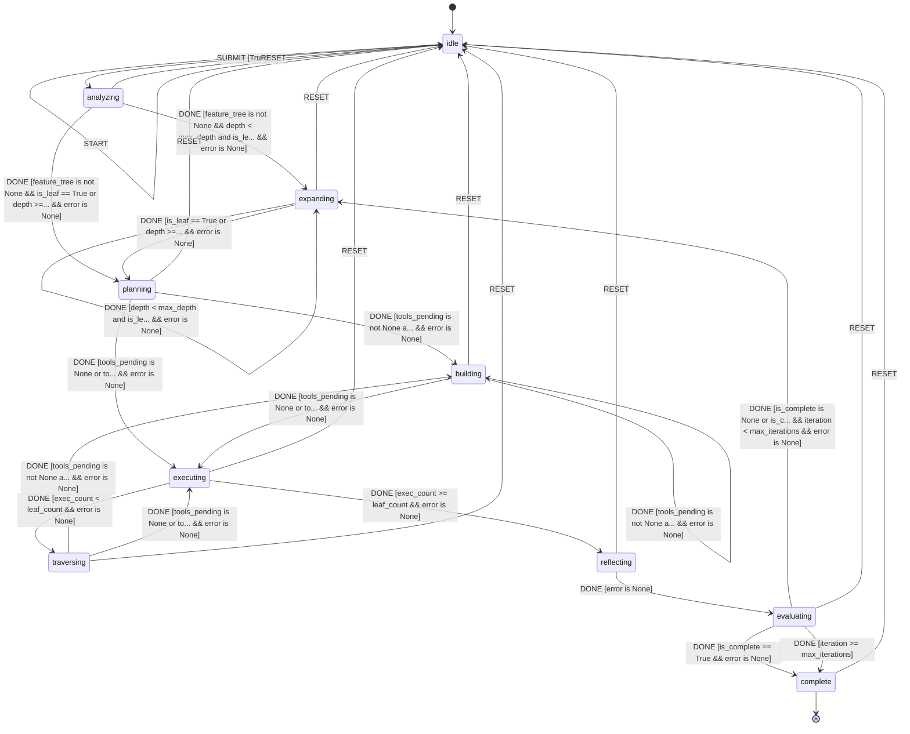

# Hierarchical Task Orchestrator

L++ skill for decomposing complex tasks into hierarchical feature trees, planning atomic work units, and executing them with LLM-powered reasoning.

**Version:** 2.0.0  
**Schema:** L++ v0.1.2

## Overview

The orchestrator follows a hierarchical feature analysis pattern:

```
Task → Feature Tree → Leaf Queue → Atomic Execution
```

1. **Analyze Root** - Break task into top-level features
2. **Expand** - Recursively expand features into sub-features (up to max_depth)
3. **Collect** - Gather all leaf nodes into execution queue
4. **Plan → Build → Execute** - Process each leaf atomically
5. **Reflect → Evaluate** - Assess progress and iterate if needed

## State Diagram


> **Interactive View:** [Open zoomable diagram](results/task_orchestrator_diagram.html) for pan/zoom controls


## Atomic Compute Units

| Unit | Purpose |
|------|---------|
| `orch:init` | Load env config (API keys, bounds) |
| `orch:analyze_root` | Create initial feature tree from task |
| `orch:expand` | Expand node into sub-features |
| `orch:collect` | Flatten leaves into execution queue |
| `orch:plan_leaf` | Plan steps + tools for leaf |
| `orch:build` | Build one L++ tool |
| `orch:exec_leaf` | Execute single leaf feature |
| `orch:next_leaf` | Advance to next leaf |
| `orch:reflect` | Assess iteration progress |
| `orch:evaluate` | Check task completion |
| `orch:incr` | Increment iteration counter |
| `orch:reset_exec` | Reset execution state for re-iteration |

## Context Schema

```json
{
  "task": "string - root task description",
  "feature_tree": "object - hierarchical feature breakdown",
  "leaf_queue": "array - flattened atomic units",
  "leaf_count": "number - total leaves",
  "exec_count": "number - executed so far",
  "depth": "number - current tree depth",
  "max_depth": "number - expansion limit (default: 3)",
  "is_leaf": "boolean - current node is atomic",
  "is_complete": "boolean - task finished",
  "iteration": "number - current iteration",
  "max_iterations": "number - iteration limit"
}
```

## Usage

```bash
# Set environment
export OPENAI_API_KEY="your-key"
export OPENAI_API_BASE="http://your-endpoint/v1"
export OPENAI_MODEL="gpt-4o-mini"
export ORCH_MAX_DEPTH=3
export ORCH_MAX_ITER=5

# Run
python interactive.py
> build a REST API with authentication and rate limiting
```

## Build & Verify

```bash
# Compile + TLA+ verify
./utils/build_skill.sh utils/task_orchestrator --validate

# With Mermaid diagram
./utils/build_skill.sh utils/task_orchestrator --validate --mermaid
```

## Example Feature Tree

For task "Build a TODO CLI":

```
root: Build TODO CLI
├── f1: Command Parsing
│   ├── sf1: Command Registration
│   │   ├── Define Registry Data Structure  ← leaf
│   │   ├── Implement Registration Function ← leaf
│   │   └── Implement Lookup Function       ← leaf
│   └── sf2: Argument Parsing
│       ├── Tokenize Input                  ← leaf
│       └── Handle Escape Sequences         ← leaf
├── f2: Data Persistence
│   ├── sf1: Choose Format
│   └── sf2: CRUD Operations
├── f3: Task CRUD
└── f4: Status Management
```

Each leaf becomes an atomic execution unit with its own plan and tool requirements.

## Logic Graph (Auto-decoded from Python)

This visualization was auto-generated by analyzing the Python compute module.

**View:** [Open task_orchestrator_logic_graph.html](results/task_orchestrator_logic_graph.html)

| Metric | Value |
|--------|-------|
| States | 0 |
| Transitions | 0 |
| Entry | `idle` |
| Terminal | ['complete', 'error'] |

## State Machine Visualization

Interactive state machine diagram: [task_orchestrator_graph.html](results/task_orchestrator_graph.html)

Open the HTML file in a browser for:
- Zoom/pan navigation
- Click nodes to highlight connections
- Hover for gate conditions
- Multiple layout options (hierarchical, horizontal, circular, grid)
