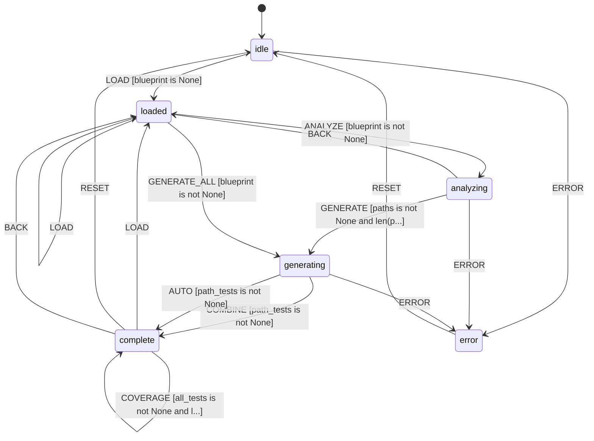

# L++ Test Case Generator

Auto-generates comprehensive test cases from L++ blueprints to ensure thorough testing of state machines.

## Features

### Test Generation Strategies

1. **Path Coverage** - Generate event sequences that traverse all transitions
2. **State Coverage** - Ensure every state is visited at least once
3. **Gate Boundary Testing** - Analyze gate expressions for boundary conditions
4. **Negative Testing** - Generate invalid event sequences and gate failure scenarios
5. **Property-Based Testing** - Generate tests based on context schema

### Output Formats

- **L++ JSON Format** - Structured test suite for L++ operators
- **Python pytest Format** - Ready-to-run pytest module

## Usage

### Interactive CLI

```bash
python interactive.py [blueprint_path]
```

Commands:
- `load <path>` - Load a blueprint to generate tests for
- `analyze` - Analyze blueprint structure (build graph, find paths)
- `generate` - Generate all test types
- `generate-all` - Load, analyze, and generate in one step
- `format json|pytest` - Format tests for export
- `export <path>` - Export formatted tests to file
- `coverage` - Show coverage report
- `paths` - Show discovered paths
- `tests` - Show generated tests (summary)

### Programmatic Usage

```python
from src.test_compute import (
    load_blueprint, build_graph, analyze_paths, analyze_gates,
    generate_path_tests, generate_state_tests, generate_gate_tests,
    generate_negative_tests, generate_property_tests, combine_tests,
    format_json, format_pytest, export_tests
)

# Load blueprint
result = load_blueprint({'path': 'path/to/blueprint.json'})
bp = result['blueprint']

# Build graph and analyze paths
graph = build_graph({'blueprint': bp})['graph']
paths = analyze_paths({'blueprint': bp, 'graph': graph})['paths']
gates = analyze_gates({'blueprint': bp})['analysis']

# Generate tests
path_tests = generate_path_tests({'blueprint': bp, 'paths': paths})['tests']
state_tests = generate_state_tests({'blueprint': bp, 'paths': paths})['tests']
gate_tests = generate_gate_tests({'blueprint': bp, 'gate_analysis': gates})['tests']
neg_tests = generate_negative_tests({'blueprint': bp, 'graph': graph})['tests']
prop_tests = generate_property_tests({'blueprint': bp})['tests']

# Combine and get coverage
combined = combine_tests({
    'blueprint': bp,
    'path_tests': path_tests,
    'state_tests': state_tests,
    'gate_tests': gate_tests,
    'negative_tests': neg_tests,
    'property_tests': prop_tests
})

print(f"Total tests: {len(combined['tests'])}")
print(f"Coverage: {combined['coverage']}")

# Export as JSON
json_out = format_json({'blueprint': bp, 'tests': combined['tests']})
export_tests({'content': json_out['output'], 'path': 'tests.json', 'format': 'json'})

# Export as pytest
pytest_out = format_pytest({'blueprint': bp, 'tests': combined['tests']})
export_tests({'content': pytest_out['output'], 'path': 'test_bp.py', 'format': 'pytest'})
```

## State Machine


> **Interactive View:** [Open zoomable diagram](results/test_generator_diagram.html) for pan/zoom controls


## Context Schema

| Property | Type | Description |
|----------|------|-------------|
| `blueprint` | object | The loaded blueprint to generate tests for |
| `blueprint_path` | string | Path to the loaded blueprint file |
| `graph` | object | Adjacency graph of states and transitions |
| `paths` | array | All discovered paths through the state machine |
| `gate_analysis` | object | Boundary conditions extracted from gates |
| `path_tests` | array | Generated path coverage tests |
| `state_tests` | array | Generated state coverage tests |
| `gate_tests` | array | Generated gate boundary tests |
| `negative_tests` | array | Generated negative/invalid input tests |
| `property_tests` | array | Generated property-based tests |
| `all_tests` | array | Combined test suite |
| `output_format` | string | Export format: json or pytest |
| `formatted_output` | string | Formatted test output string |
| `coverage_report` | object | Coverage analysis report |

## Transitions

| ID | From | To | Event | Gates | Actions |
|----|------|-----|-------|-------|---------|
| t_load | idle | loaded | LOAD | no_blueprint | load_blueprint |
| t_reload | loaded | loaded | LOAD | - | clear_state, load_blueprint |
| t_analyze | loaded | analyzing | ANALYZE | has_blueprint | build_graph, analyze_paths, analyze_gates |
| t_generate_all | loaded | generating | GENERATE_ALL | has_blueprint | build_graph, analyze_paths, analyze_gates, generate_* |
| t_generate | analyzing | generating | GENERATE | has_paths | generate_path_tests, generate_state_tests, ... |
| t_combine | generating | complete | COMBINE | has_path_tests | combine_tests |
| t_auto_combine | generating | complete | AUTO | has_path_tests | combine_tests |
| t_format_json | complete | complete | FORMAT_JSON | has_tests | set_format_json, format_as_json |
| t_format_pytest | complete | complete | FORMAT_PYTEST | has_tests | set_format_pytest, format_as_pytest |
| t_export | complete | complete | EXPORT | has_output | export_tests |
| t_reset | complete | idle | RESET | - | clear_state |

## Compute Units

| Unit | Description |
|------|-------------|
| `testgen:load_blueprint` | Load L++ blueprint from JSON file |
| `testgen:build_graph` | Build adjacency graph from transitions |
| `testgen:analyze_paths` | Find all paths using BFS |
| `testgen:analyze_gates` | Extract boundary conditions from gates |
| `testgen:generate_path_tests` | Generate path coverage tests |
| `testgen:generate_state_tests` | Generate state coverage tests |
| `testgen:generate_gate_tests` | Generate gate boundary tests |
| `testgen:generate_negative_tests` | Generate negative/invalid tests |
| `testgen:generate_property_tests` | Generate property-based tests |
| `testgen:combine_tests` | Combine all tests and compute coverage |
| `testgen:format_json` | Format tests as L++ JSON |
| `testgen:format_pytest` | Format tests as pytest module |
| `testgen:export_tests` | Write formatted tests to file |
| `testgen:clear_state` | Reset all analysis state |

## Example Output

### JSON Format
```json
{
  "test_suite": "my_blueprint_tests",
  "blueprint_id": "my_blueprint",
  "tests": [
    {
      "id": "path_1",
      "type": "path_coverage",
      "description": "Path: idle -> processing -> complete",
      "initial_context": {"value": 0},
      "events": [
        {"event": "START", "payload": {}},
        {"event": "PROCESS", "payload": {}},
        {"event": "FINISH", "payload": {}}
      ],
      "expected_final_state": "complete"
    }
  ]
}
```

### Pytest Format
```python
def test_path_1(operator):
    """Path: idle -> processing -> complete"""
    operator.context['value'] = 0
    operator.dispatch('START', {})
    operator.dispatch('PROCESS', {})
    operator.dispatch('FINISH', {})
    assert operator.state == 'complete'
```

## Coverage Report

The coverage report includes:

- **Total Tests**: Number of generated tests
- **By Type**: Breakdown by test type (path, state, gate, negative, property)
- **State Coverage**: Percentage of states covered
- **Transition Coverage**: Percentage of transitions covered
- **Gate Coverage**: Percentage of gates tested

## State Machine Visualization

Interactive state machine diagram: [test_generator_graph.html](results/test_generator_graph.html)

Open the HTML file in a browser for:
- Zoom/pan navigation
- Click nodes to highlight connections
- Hover for gate conditions
- Multiple layout options (hierarchical, horizontal, circular, grid)
