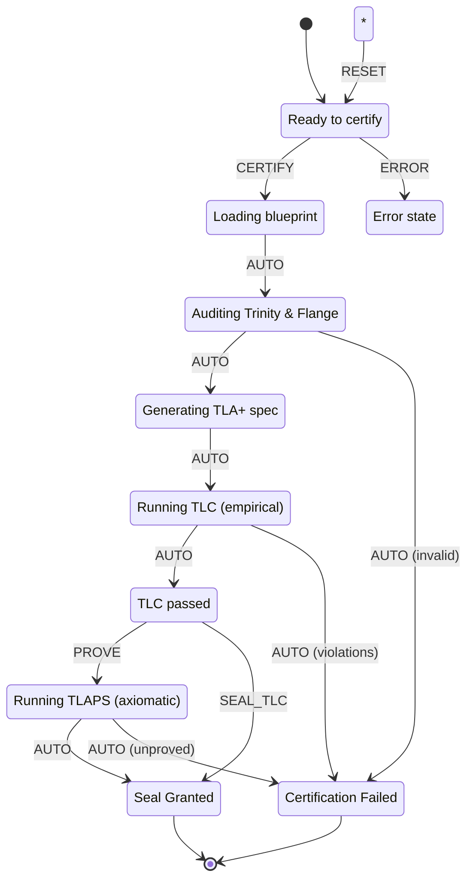

# TLAPS Seal Certifier

**The Standard for Certified Logic Integrity**

> *Intelligence is the reactant. L++ is the vessel. The TLAPS Seal is the pressure rating.*

## Overview

The TLAPS Seal Certifier is an L++ skill that provides formal verification and certification of L++ blueprints. It implements the transition from **Empirical Observation** (TLC model checking) to **Axiomatic Certainty** (TLAPS theorem proving).

## The Three Pillars

### 1. Axiomatic Sovereignty
Certifies that the blueprint's **Trinity** (Transitions, Gates, Actions) is structurally sound across an infinite state space.

### 2. Compositional Certainty
Validates the **Flange** (context schema) to ensure hermetic data boundaries for safe Logic Stacking.

### 3. Evolutionary Stability
Provides a certification baseline that governs future logic evolution.

## Seal Levels

| Level | Status | Suitable For |
|-------|--------|--------------|
| `TLC_VERIFIED` | Empirical | Lab, Development, Scholar |
| `TLAPS_CERTIFIED` | Axiomatic | Kernel, Infrastructure, Autonomous |

## State Machine



## Usage

```bash
cd utils/tlaps_seal
python interactive.py
```

### Commands

| Command | Description |
|---------|-------------|
| `certify <path>` | Load blueprint and run through TLC verification |
| `prove` | Upgrade from TLC to TLAPS certification (requires TLAPS) |
| `seal` | Grant TLC-level seal without TLAPS proof |
| `view` | Display the seal certificate |
| `reset` | Return to idle state |
| `quit` | Exit |

### Example Session

```
[idle]> certify ../skill_registry/skill_registry.json
Seal: EMPIRICAL | Level: TLC_VERIFIED

[tlc_verified]> prove
Seal: AXIOMATIC | Level: TLAPS_CERTIFIED

[certified]> view
{
  "seal": "AXIOMATIC",
  "level": "TLAPS_CERTIFIED",
  "timestamp": "2025-12-30T15:30:00Z",
  "blueprint": {
    "id": "skill_registry",
    "name": "Skill Registry",
    "version": "1.0.0",
    "hash": "a1b2c3d4e5f6..."
  },
  "verification": {
    "trinity": {"transitions": 15, "gates": 6, "actions": 8, "valid": true},
    "flange": {"properties": 5, "hermeticity": 0.8, "valid": true},
    "tlc": {"passed": true, "statesExplored": 1024},
    "tlaps": {"passed": true, "theorems": {"TypeSafety": "proved", ...}}
  },
  "oath": [
    "The Logic is Converged: No path leads to unhandled deadlock.",
    "The Context is Hermetic: No data violates schema boundaries.",
    "The Flesh is Governed: Volatile compute is bound by bone."
  ]
}
```

## The Engineering Oath

By granting the TLAPS Seal, we certify:

1. **The Logic is Converged** - No path leads to an unhandled deadlock
2. **The Context is Hermetic** - No data can violate the schema boundaries
3. **The Flesh is Governed** - The volatile compute layer is strictly bound by the deterministic bone

## Files

| File | Purpose |
|------|---------|
| `tlaps_seal.json` | L++ Blueprint (The Bone) |
| `src/seal_compute.py` | Compute Units (The Flesh) |
| `interactive.py` | CLI Wrapper (The Extrusion) |
| `tla/tlaps_seal.tla` | TLA+ Specification |
| `tla/tlaps_seal.cfg` | TLC Configuration |

## Dependencies

- **Required**: Python 3.8+, L++ Frame
- **TLC Verification**: TLA+ Toolbox (`tlc` command)
- **TLAPS Certification**: TLAPS (`tlapm` command)

## Version

- Schema: `lpp/v0.1.2`
- Skill: `1.0.0`

## Logic Graph (Auto-decoded from Python)

This visualization was auto-generated by analyzing the Python compute module.

**View:** [Open tlaps_seal_logic_graph.html](results/tlaps_seal_logic_graph.html)

| Metric | Value |
|--------|-------|
| States | 0 |
| Transitions | 0 |
| Entry | `idle` |
| Terminal | ['complete', 'error'] |
