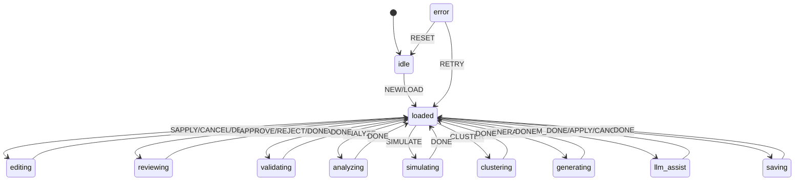

# L++ Canvas

A higher-assembly blueprint studio for creating, reviewing, auditing, simulating, and editing L++ blueprints with LLM assistance and interactive GUI.

## Features

1. **Blueprint Creation** - Create blueprints from scratch with guided workflow
2. **LLM Assistance** - AI-powered help for designing and improving blueprints
3. **Review & Audit** - Add review notes, track changes with audit log
4. **TLC Validation** - Run formal verification and highlight errors
5. **Path Analysis** - Calculate all execution paths and identify deadlocks
6. **Simulation** - Role-play as user to walk through the graph
7. **Node Editing** - Select and edit states, transitions, gates, actions in place
8. **Interactive GUI** - User-friendly web interface hosted via Flask
9. **Clustering** - Sort and cluster states by dependency
10. **Visualization** - Generate Mermaid diagrams and interactive graphs

## Quick Start

### CLI Mode
```bash
cd workflows/lpp_canvas
python3 interactive.py
```

### Web GUI
```bash
cd workflows/lpp_canvas
python3 app.py
# Open http://localhost:5001
```

## State Machine



## API Endpoints

| Endpoint | Method | Description |
|----------|--------|-------------|
| `/api/state` | GET | Get current state and context |
| `/api/dispatch` | POST | Dispatch event with payload |
| `/api/blueprint` | GET/POST | Get or set blueprint |
| `/api/graph` | GET | Get interactive graph HTML |
| `/api/validate` | POST | Run TLC validation |
| `/api/analyze` | POST | Analyze paths and states |
| `/api/simulate` | POST | Control simulation |
| `/api/cluster` | POST | Compute clusters |
| `/api/review` | POST | Manage review session |
| `/api/llm` | POST | LLM assistant queries |
| `/api/edit` | POST | Edit blueprint nodes |
| `/api/save` | POST | Save blueprint to file |
| `/api/load` | POST | Load blueprint from file |
| `/api/new` | POST | Create new blueprint |
| `/api/audit` | GET | Get audit log |

## Compute Units

| Unit | Description |
|------|-------------|
| `canvas:init_new` | Initialize empty blueprint |
| `canvas:load_blueprint` | Load from file |
| `canvas:select_node` | Select node for editing |
| `canvas:apply_edit` | Apply edits to node |
| `canvas:run_tlc` | Run TLC validation |
| `canvas:analyze_paths` | Analyze execution paths |
| `canvas:init_simulation` | Start simulation |
| `canvas:sim_step` | Execute simulation step |
| `canvas:compute_clusters` | Compute state clusters |
| `canvas:start_review` | Start review session |
| `canvas:llm_query` | Query LLM for assistance |
| `canvas:generate_outputs` | Generate graph and mermaid |

## State Machine Visualization

Interactive state machine diagram: [lpp_canvas_graph.html](results/lpp_canvas_graph.html)

Open the HTML file in a browser for:
- Zoom/pan navigation
- Click nodes to highlight connections
- Hover for gate conditions
- Multiple layout options
