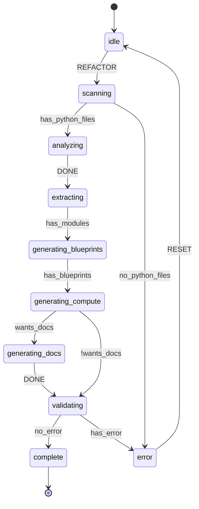

# Python to L++ Refactorer

Automatically refactors a Python repository into an L++ based project with full documentation.

## Architecture

This workflow **orchestrates existing L++ utils** rather than reimplementing functionality. It calls:

| Utils Tool | Purpose |
|------------|---------|
| `legacy_extractor` | Extract state machine patterns from Python code |
| `logic_decoder` | Decode business logic into gates and actions |
| `blueprint_builder` | Build L++ blueprints from extracted patterns |
| `doc_generator` | Generate documentation, graphs, and diagrams |
| `dashboard` | Create project overview dashboard |

See [DESIGN.md](DESIGN.md) for detailed architecture documentation.

## Overview

This workflow analyzes Python code and extracts:
- Classes with state machine patterns
- Workflow functions
- Service modules

It then generates:
- L++ blueprint JSON files
- Compute function stubs
- Full documentation (graphs, diagrams, READMEs)

## Usage

```bash
# Basic usage
python interactive.py /path/to/your/project

# Custom output path
python interactive.py /path/to/project -o /path/to/output

# Include test files in analysis
python interactive.py /path/to/project --include-tests

# Skip documentation generation
python interactive.py /path/to/project --no-docs

# Verbose output
python interactive.py /path/to/project -v
```

## Options

| Option | Description |
|--------|-------------|
| `project` | Path to the Python project to refactor (required) |
| `-o, --output PATH` | Output path for generated L++ project |
| `-n, --name NAME` | Project name (default: directory name) |
| `--include-tests` | Include test files in analysis |
| `--no-docs` | Skip documentation generation |
| `-v, --verbose` | Verbose output |

## What Gets Analyzed

The refactorer looks for these patterns in your Python code:

### State Machine Patterns
- Classes with `State` in the name
- Attributes like `self.state`, `self._state`
- Methods named `on_enter`, `on_exit`, `transition`
- Variables like `current_state`, `next_state`

### Workflow Patterns
- Async functions with `async def run`
- Functions named `execute`, `process`, `main`
- Generator patterns with `yield from`
- While loops with `while running`

## Output Structure

```
lpp_output/
├── README.md                  # Project overview
├── refactor_summary.json      # Refactoring summary
├── module_name/
│   ├── module_name.json       # L++ blueprint
│   ├── src/
│   │   └── module_name_compute.py  # Compute functions
│   ├── results/
│   │   ├── module_name_graph.html      # Interactive graph
│   │   ├── module_name_diagram.html    # Mermaid diagram
│   │   └── module_name.mmd             # Mermaid source
│   └── README.md              # Module documentation
└── ...
```

## Example

Given a Python project with this class:

```python
class OrderProcessor:
    """Processes customer orders."""

    def __init__(self):
        self.state = "idle"

    def validate_order(self, order):
        """Validate the order data."""
        self.state = "validating"
        # validation logic
        return True

    def process_payment(self, order):
        """Process payment for the order."""
        self.state = "processing_payment"
        # payment logic
        return True

    def ship_order(self, order):
        """Ship the order."""
        self.state = "shipping"
        # shipping logic
        return True
```

The refactorer generates:

**order_processor.json**
```json
{
  "$schema": "lpp/v0.1.2",
  "id": "order_processor",
  "name": "OrderProcessor",
  "version": "1.0.0",
  "description": "Processes customer orders.",
  "states": {
    "idle": { "description": "Awaiting input" },
    "validating": { "description": "State: validating" },
    "processing_payment": { "description": "State: processing_payment" },
    "shipping": { "description": "State: shipping" },
    "complete": { "description": "Processing complete" },
    "error": { "description": "Error occurred" }
  },
  "entry_state": "idle",
  "terminal_states": ["complete", "error"],
  "actions": {
    "validate_order": { "type": "compute", "unit": "order_processor:validate_order" },
    "process_payment": { "type": "compute", "unit": "order_processor:process_payment" },
    "ship_order": { "type": "compute", "unit": "order_processor:ship_order" }
  },
  "transitions": [...]
}
```

## Workflow States



## Post-Refactoring Steps

After running the refactorer:

1. **Review Blueprints**: Check the generated JSON files for accuracy
2. **Implement Compute Functions**: Fill in the TODO stubs in `*_compute.py`
3. **Regenerate Documentation**: Run `./deploy.sh -p <output_path>`
4. **Customize Transitions**: Add gates and refine state transitions
5. **Add Tests**: Create test cases for each state transition

## Integration with L++ Tools

The generated project works with all L++ documentation tools:

```bash
# Generate all documentation
./deploy.sh -p /path/to/lpp_output docs

# Generate only Mermaid diagrams
./deploy.sh -p /path/to/lpp_output mermaid

# View in dashboard
./deploy.sh -p /path/to/lpp_output dashboard
```

## Limitations

- Deeply nested state machines may not be fully extracted
- Dynamic state assignments (e.g., `self.state = get_state()`) are not tracked
- Complex inheritance hierarchies are simplified
- Generated transitions are basic and need manual refinement

## Contributing

### Improving Pattern Detection

Edit `src/py2lpp_compute.py`:
- Add patterns to `smPatterns` for state machine detection
- Add patterns to `wfPatterns` for workflow detection
- Enhance `_extract_class_module()` for better class analysis

### Adding New Utils Integration

To integrate a new util:
1. Add the util to `utils/` following L++ patterns
2. Add lazy loading in `_load_utils()` function
3. Call the util's `COMPUTE_REGISTRY` from workflow compute functions
4. Update `DESIGN.md` with the new integration
